# MySQL ERD

- 상태: generated
- 기준 원본: [Backend Flyway migrations](../../services/backend/src/main/resources/db/migration/)
- 검토용 미러: [schema.sql](schema.sql)
- 생성 명령: `python tools/generate_erd.py`

이 파일은 `contracts/database/schema.sql`의 테이블과 외래 키에서 자동 생성한다. 직접 수정하지 않고 스키마를 변경한 뒤 생성 명령을 다시 실행한다.

```mermaid
erDiagram
    training_templates {
        BIGINT id PK "required"
        BIGINT curriculum_unit_id FK "required"
        VARCHAR_100 name "required"
        JSON form "required"
        INT sequence_no "required"
    }
    students {
        BIGINT id PK "required"
        BIGINT teacher_id FK "required"
        VARCHAR_10 name "required"
        DATE birthday "nullable"
        VARCHAR_10 gender "nullable"
        VARCHAR_20 school "nullable"
        VARCHAR_100 guardian "nullable"
        VARCHAR_20 guardian_contact "nullable"
        VARCHAR_50 guardian_email "nullable"
        VARCHAR_100 address "nullable"
        TIMESTAMP created_at "required"
        VARCHAR_255 image_url "nullable"
        TEXT teacher_memo "nullable"
    }
    curriculum_units {
        BIGINT id PK "required"
        VARCHAR_50 unit_name "required"
        INT sequence_no "required"
    }
    sounds {
        BIGINT id PK "required"
        INT question_number "required"
        VARCHAR_255 original_file_name "required"
        BIGINT file_size "required"
        TIMESTAMP created_at "required"
        VARCHAR_255 store_file_name "required"
        VARCHAR_255 url "required"
    }
    story_templates {
        BIGINT id PK "required"
        VARCHAR_50 title "required"
        TEXT content "required"
    }
    images {
        BIGINT id PK "required"
        VARCHAR_255 original_file_name "required"
        VARCHAR_255 store_file_name "required"
        BIGINT file_size "required"
        VARCHAR_255 url "required"
        TIMESTAMP created_at "required"
    }
    word_categories {
        BIGINT id PK "required"
        BIGINT word_id FK "required"
        VARCHAR_50 category_name "required"
    }
    training_contents {
        BIGINT id PK "required"
        BIGINT training_id FK "required"
        JSON generated_data "nullable"
        TIMESTAMP created_at "nullable"
    }
    stories {
        BIGINT id PK "required"
        BIGINT student_id FK "required"
        BIGINT story_template_id FK "required"
        TIMESTAMP created_at "required"
        VARCHAR_30 status "required"
        TINYINT_UNSIGNED progress "required"
    }
    test_questions {
        VARCHAR_255 id PK "required"
        BIGINT test_id FK "required"
        JSON question "nullable"
    }
    gaze_analysis_results {
        BIGINT id PK "required"
        BIGINT gaze_session_id FK "required"
        INT total_visited_duration "required"
        INT total_visited_count "required"
        INT reverse_read_count "required"
        INT avg_visited_duration "nullable"
        TIMESTAMP created_at "required"
    }
    gaze_sessions {
        BIGINT id PK "required"
        BIGINT student_id FK "required"
        BIGINT test_id FK "nullable"
        BIGINT training_id FK "nullable"
        BIGINT story_id FK "nullable"
        VARCHAR_20 content_type "required"
        TIMESTAMP started_at "required"
        TIMESTAMP ended_at "nullable"
        VARCHAR_20 status "required"
        VARCHAR_20 calibration_status "required"
        TIMESTAMP created_at "required"
    }
    student_study_progresses {
        BIGINT id PK "required"
        BIGINT student_id FK "required"
        BIGINT training_template_id FK "required"
        TINYINT_UNSIGNED achievement "required"
    }
    student_word_stats {
        BIGINT id PK "required"
        BIGINT student_id FK "required"
        BIGINT word_id FK "required"
        DECIMAL_5_2 word_score "required"
        INT_UNSIGNED correct_count "required"
        INT_UNSIGNED failed_count "required"
        INT_UNSIGNED attempt_count "required"
        TIMESTAMP updated_at "nullable"
    }
    words {
        BIGINT id PK "required"
        VARCHAR_50 content "required"
        INT length "required"
    }
    reports {
        BIGINT id PK "required"
        BIGINT student_id FK "required"
        DATE start_date "required"
        DATE end_date "required"
        JSON snapshot_data "required"
        TEXT teacher_memo "nullable"
        TIMESTAMP created_at "required"
    }
    videos {
        BIGINT id PK "required"
        INT question_number "required"
        VARCHAR_255 original_file_name "required"
        BIGINT file_size "required"
        TIMESTAMP created_at "required"
        VARCHAR_255 store_file_name "required"
        VARCHAR_255 url "required"
    }
    teachers {
        BIGINT id PK "required"
        VARCHAR_50 login_id "required"
        VARCHAR_50 email "required"
        VARCHAR_100 password "required"
        VARCHAR_10 name "required"
        VARCHAR_100 organization "nullable"
        TIMESTAMP created_at "required"
        VARCHAR_10 gender "nullable"
        VARCHAR_255 image_url "nullable"
    }
    auth_refresh_sessions {
        BIGINT id PK "required"
        BIGINT teacher_id FK "required"
        BIGINT student_id FK "nullable"
        VARCHAR_30 audience "required"
        CHAR_64 token_hash "required"
        TIMESTAMP expires_at "required"
        TIMESTAMP revoked_at "nullable"
        TIMESTAMP created_at "required"
    }
    auth_revoked_access_tokens {
        CHAR_36 token_id PK "required"
        TIMESTAMP expires_at "required"
        TIMESTAMP revoked_at "required"
    }
    story_lines {
        BIGINT id PK "required"
        BIGINT story_id FK "required"
        BIGINT previous_line_id "nullable"
        VARCHAR_255 image_url "nullable"
        BOOLEAN requires_branch_input "required"
        TEXT content "required"
        INT sequence_no "required"
        TIMESTAMP created_at "required"
        TIMESTAMP read_at "nullable"
    }
    word_attempt_logs {
        BIGINT id PK "required"
        BIGINT student_id FK "required"
        BIGINT word_id FK "required"
        BIGINT story_line_id "nullable"
        BIGINT training_id "nullable"
        BIGINT test_id "nullable"
        VARCHAR_10 use_location "required"
        VARCHAR_50 surface_text "nullable"
        BOOLEAN has_gaze_data "required"
        BOOLEAN has_audio_data "required"
        INT fixation_duration_ms "nullable"
        INT fixation_count "nullable"
        INT gaze_start_offset_ms "nullable"
        INT gaze_end_offset_ms "nullable"
        BOOLEAN is_skipped "nullable"
        INT regression_count "nullable"
        VARCHAR_255 recognized_text "nullable"
        INT speech_start_offset_ms "nullable"
        INT speech_end_offset_ms "nullable"
        BOOLEAN is_correct "nullable"
        INT_UNSIGNED total_score "required"
        TIMESTAMP created_at "required"
    }
    character {
        BIGINT id PK "required"
        BIGINT student_id FK "required"
        VARCHAR_255 image_url "nullable"
        BOOLEAN is_representative "required"
        TIMESTAMP created_at "required"
    }
    trainings {
        BIGINT id PK "required"
        BIGINT training_template_id FK "required"
        BIGINT daily_curriculum_id FK "required"
        INT sequence_no "required"
        TIMESTAMP created_at "required"
        TIMESTAMP started_at "nullable"
        TIMESTAMP finished_at "nullable"
        VARCHAR_20 status "required"
        JSON result "nullable"
        DECIMAL_5_2 accuracy "nullable"
    }
    daily_curriculums {
        BIGINT id PK "required"
        BIGINT student_id FK "required"
        VARCHAR_20 status "required"
        TIMESTAMP created_at "required"
        TIMESTAMP completed_at "nullable"
    }
    tests {
        BIGINT id PK "required"
        BIGINT student_id FK "required"
        TIMESTAMP created_at "required"
        VARCHAR_20 status "nullable"
        JSON result "nullable"
        DECIMAL_5_2 accuracy "nullable"
    }
    teachers ||--o{ students : "teacher_id"
    teachers ||--o{ auth_refresh_sessions : "teacher_id"
    students o|--o{ auth_refresh_sessions : "student_id"
    curriculum_units ||--o{ training_templates : "curriculum_unit_id"
    words ||--o{ word_categories : "word_id"
    trainings ||--o{ training_contents : "training_id"
    students ||--o{ stories : "student_id"
    story_templates ||--o{ stories : "story_template_id"
    tests ||--o{ test_questions : "test_id"
    gaze_sessions ||--o{ gaze_analysis_results : "gaze_session_id"
    students ||--o{ gaze_sessions : "student_id"
    tests o|--o{ gaze_sessions : "test_id"
    trainings o|--o{ gaze_sessions : "training_id"
    stories o|--o{ gaze_sessions : "story_id"
    students ||--o{ student_study_progresses : "student_id"
    training_templates ||--o{ student_study_progresses : "training_template_id"
    students ||--o{ student_word_stats : "student_id"
    words ||--o{ student_word_stats : "word_id"
    students ||--o{ reports : "student_id"
    stories ||--o{ story_lines : "story_id"
    students ||--o{ word_attempt_logs : "student_id"
    words ||--o{ word_attempt_logs : "word_id"
    students ||--o{ character : "student_id"
    training_templates ||--o{ trainings : "training_template_id"
    daily_curriculums ||--o{ trainings : "daily_curriculum_id"
    students ||--o{ daily_curriculums : "student_id"
    students ||--o{ tests : "student_id"
```

