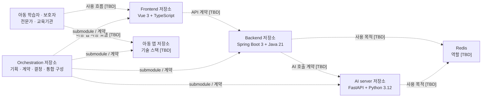

# 시스템 컨텍스트

- 상태: proposed
- 최종 검토일: 2026-07-24

현재 다이어그램은 확정된 사용자·이해관계자와 저장소 분리 원칙만 표현한다. 사용자별 흐름, 서비스 책임, 호출 방향과 외부 시스템은 결정하지 않았다.

## 미결 경계

- 인증과 사용자 데이터의 소유 서비스
- 동기 HTTP, 비동기 메시징 등 서비스 간 통신 방식
- AI 작업의 요청·상태·결과 저장 방식
- Redis를 사용하는 서비스와 장애 시 동작
- 외부 AI 모델, 스토리지, 관측 도구와 배포 환경
- Frontend와 아동 앱의 사용자·기능 책임 경계
