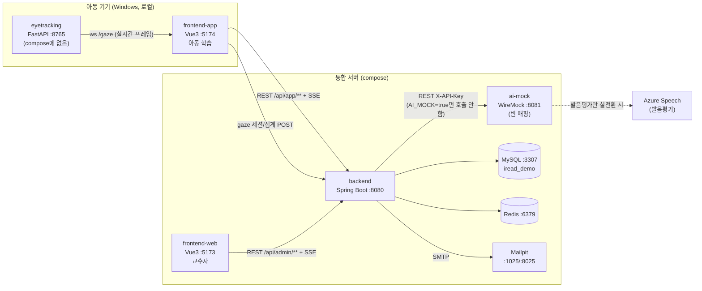
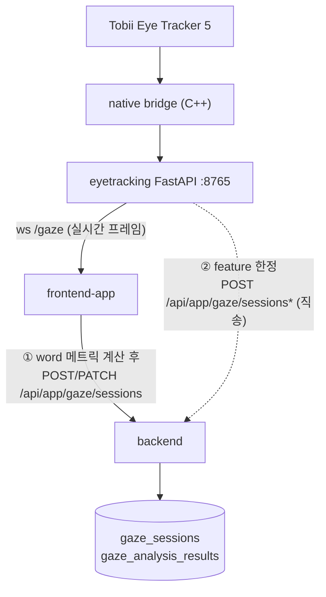

# 시스템 통합 작업용 하네스

- 상태: draft (전체 순회 1차 정리)
- 최종 검토일: 2026-07-31
- 대상 커밋: 오케스트레이션 `a438f0c`, 서브모듈 HEAD는 [서브모듈 체크아웃 상태](#서브모듈-체크아웃--브랜치-현황) 참고

> 이 문서는 **통합 작업을 할 때 펼쳐놓고 보는 작업용 참조 맵**입니다. `tools/validate_harness.py`가 검증하는 “오케스트레이션 하네스(진입 파일·링크·메타데이터 검증)”와는 다른 뜻으로 썼습니다. 사실은 각 서브모듈과 루트 파일을 직접 순회해 확보했고, 근거는 `file_path:line`로 남겼습니다. 서브모듈 내부가 바뀌면 해당 줄이 달라질 수 있으니 작업 전 최신 코드로 교차 확인하세요.

## TL;DR

- iRead는 **5개 서브모듈 + 루트 오케스트레이션**으로 구성됩니다. `backend`(Spring Boot)가 중심이고, 두 프론트(`frontend-web`=교수자, `frontend-app`=아동), `ai`(FastAPI 발음평가·생성 mock), `eyetracking`(Tobii 로컬 브릿지)이 주변에 있습니다.
- **정상 동작하는 통합 환경은 아직 없습니다.** `compose.yml`은 5개 중 3개(backend, frontend-web, frontend-app)만 띄우고, `ai`는 빈 WireMock으로, `eyetracking`은 아예 빠져 있습니다. 게다가 `start-all-local.bat`은 **다른 credentials·포트·JWT 시크릿**을 쓰는 `services/backend/docker-compose.yml`을 가리키며, 백엔드가 실제로는 뜨지 않습니다. 두 경로가 충돌합니다.
- **가장 큰 위험 3가지**: (1) 두 기동 경로의 환경 불일치, (2) `eyetracking`/`ai`의 compose 누락, (3) 시선(gaze) 데이터 흐름의 식별자·집계 정합성. 자세한 것은 [통합 위험 레지스터](#통합-위험-레지스터)를 보세요.



## 서브모듈·서비스 매핑

| 서브모듈 | compose 서비스 | 역할 | 호스트:컨테이너 포트 | 비고 |
| --- | --- | --- | --- | --- |
| `services/backend` | `backend` | 중심 API 서버 | `8080:8080` | Spring Boot 4.0.7 + Java 21 |
| `services/frontend-web` | `frontend-web` | 교수자 웹 | `5173:5173` | Vue3 + pnpm, dev 서버로 구동 |
| `services/frontend-app` | `frontend-app` | 아동 학습 앱 | `5174:5174` | Vue3 + npm, 현재 `feature/learner-ui-design-refresh` |
| `services/ai` | **(없음)** | 발음평가 + 생성 mock | – | `ai-mock`(WireMock, 빈 매핑)이 대체 (`compose.yml:42-50`) |
| `services/eyetracking` | **(없음)** | Tobii 시선 브릿지 | `127.0.0.1:8765`(bat만) | compose에 정의 없음, Windows 전용 |
| – | `mysql` | 주 DB | `3307:3306` | db `iread_demo`, `iread/iread-demo` |
| – | `redis` | 세션/캐시(용도 `[TBD]`) | `6379:6379` | |
| – | `mailpit` | dev 메일함 | `1025`, `8025` | 비밀번호 재설정 메일 |
| – | `ai-mock` | AI 목 | `8081:8080` | WireMock, `services/backend/mock-ai` 마운트 |

## 서비스 카드

> 각 카드는 같은 양식입니다. 통신은 [통신 흐름](#통신-흐름)에서 흐름별로 다시 엮습니다.

### backend — 중심 API 서버

- **스택**: Spring Boot 4.0.7, Java 21, Gradle, Spring Data JPA + Flyway(MySQL 8.4), Redis, Spring Security, springdoc-openapi. `services/backend/build.gradle:3,10-30`
- **역할**: 교수자/아동 양쪽에 REST API 제공. 학생·커리큘럼·훈련·스토리·시선·리포트 도메인 관리, AI 서버 호출 오케스트레이션.
- **진입점**: `IreadBackendApplication.java:9` (`@EnableScheduling`). 실행 `./gradlew bootRun`, 데모 `--spring.profiles.active=demo`(`DEMO.md:19-21`). **서브모듈 자체 Dockerfile 없음** — compose가 소스 마운트 후 `./gradlew bootRun`(`compose.yml:79-81`).
- **API 네임스페이스(중요)**: `/api/admin/**`(권한 `AUD_admin-app`, 교수자), `/api/app/**`(권한 `AUD_learning-app`, 아동), `/api/auth/admin/*`, `/api/auth/app/*`. `SecurityConfig.java:64-67`
- **실시간**: SSE `/api/admin/realtime/events`, `/api/app/realtime/events`(15초 heartbeat). WebSocket 아님. `RealtimeController.java:17-31`
- **외부 호출**: 유일한 아웃바운드 HTTP = `ai`. `RestClient` 빈 `aiRestClient`, 헤더 `X-API-Key` + `Idempotency-Key`. `AiClientConfig.java:14-29`, `HttpAiClient.java:41-48`. eyetracking/frontend로의 직접 호출은 없음.
- **DB 모델**: Flyway 단일 기준선 `V1__baseline_schema.sql`(26개 엔티티). 핵심 테이블 `students`, `teachers`, `trainings`, `gaze_sessions`, `gaze_analysis_results`, `word_attempt_logs`, `reports`. 주의: `trainings.accuracy`(int 0~1000) vs `tests.accuracy`(decimal) 타입이 다름.
- **위험**: JWT 시크릿 빈 문자열 기본값(설정 없으면 부팅 실패, `JwtTokenService.java:147-149`), CORS 화이트리스트 `localhost:5173/5174/4173` 고정(`SecurityConfig.java:80-87`), SSE emitter 인메모리(다중 인스턴스 확장 시 주의), Spring Boot 4.0.7 비표준 메이저.

### frontend-web — 교수자 웹 (패키지명 `t-ui`)

- **스택**: Vue 3 + TypeScript + Vite 8, Pinia, vue-router, Tailwind v4 + shadcn-vue(reka-ui), ECharts 6, pnpm. `services/frontend-web/package.json`
- **역할**: 교수자 대시보드. 아동 현황, 커리큘럼, 훈련/검사/스토리 이력, 시선 분석, 기간 보고서, 프로필.
- **진입점**: `index.html` → `src/main.ts`. `pnpm dev`. **서브모듈에 Dockerfile 없음** — compose가 `node:24`에서 `pnpm dev`로 구동(`compose.yml:92-113`).
- **API 호출**: `/api/auth/admin/*`, `/api/admin/*` 하드코딩. origin만 `VITE_API_BASE_URL`(빈值=same-origin)로 교체. `apiClient.ts:83-87`
- **인증**: JWT access(Pinia 메모리) + refresh(HTTP-only 쿠키). 모든 요청 `credentials:'include'`. `apiClient.ts:172-183`
- **eyetracking/ai 직접 호출**: 없음. 시선 데이터는 backend admin API로만 조회.
- **실시간**: SSE `/api/admin/realtime/events`. 3초 폴백 폴링. `installTeacherRealtimeSync.ts`
- **위험**: 하드코딩된 `/api/admin/*` prefix, mock/api 이중 모드(`VITE_AUTH_SOURCE`/`VITE_DATA_SOURCE` 조합 오류 시 부팅 실패), 배포 시 same-origin 역프록시 권장.

### frontend-app — 아동 학습 앱 (패키지명 `iread-learner-ui`)

- **스택**: Vue 3 + TypeScript + Vite 8, Pinia, vue-router 4, `@rive-app/canvas`, 자체 CSS 토큰(`--learner-*`/`--educator-*`). **Tailwind/shadcn 없음**. npm. `services/frontend-app/package.json`
- **역할**: 아동 읽기 학습 클라이언트. 교사 로그인 → 아동 선택 → 학습 세션. 현재 `feature/learner-ui-design-refresh`(develop 대비 172파일 변경 중).
- **진입점**: `index.html` → `src/main.ts`. `npm run dev`. **서브모듈에 Dockerfile 없음** — compose가 `node:24`에서 `npm run dev :5174`로 구동(`compose.yml:115-134`).
- **API 호출**: `/api/auth/app/*`(2단계: teacher-login→`bootstrapToken`→student-login→`accessToken`), `/api/app/**`(training/test/story/gaze/student/mypage). `apiLearnerAuthRepository.ts:48-114`
- **eyetracking 연동(핵심, 2축)**:
  - **(a) 실시간 프레임**: `ws://127.0.0.1:8765/gaze`, `http://127.0.0.1:8765/api/mode` — **하드코딩, env 분리 안 됨**. `useTobiiGazeBridge.ts:94-95`
  - **(b) 집계 영속**: 레슨 종료 시 **프론트에서 word 메트릭(dwell/visit/read/skipped/regression) 계산** 후 `POST/PATCH /api/app/gaze/sessions`로 전송. `TrainingLessonView.vue:786-797`, `mockDeviceSubmissions.ts`
- **ai 직접 호출**: 없음. STT/발음평가/TTS/스토리 분기는 모두 `/api/app/**`로 래핑.
- **실시간**: SSE `/api/app/realtime/events` + 3초 폴백 폴링.
- **위험**: (1) **`VITE_MOCK_DEVICE_SUBMISSIONS/VOICE/GAZE` 기본값 `true`** — api 모드여도 가짜 gaze/음성이 백엔드로 감(`mockDeviceSubmissions.ts:13-24`). (2) 8765 하드코딩 → 컨테이너 안 dev 서버는 `127.0.0.1`이 자기 자신이라 호스트 브릿지에 닿지 않음. (3) 시선 집계 로직이 프론트에 있어 eyetracking/백엔드 재집계 시 이중 계산.

### ai — 발음평가 + 생성 mock (FastAPI)

- **스택**: Python ≥3.12, FastAPI + uvicorn, Pydantic v2, `azure-cognitiveservices-speech`. ML 프레임워크/로컬 모델 없음. `services/ai/pyproject.toml:5-11`
- **역할**: (a) Azure Speech 단어별 발음평가(ko-KR), (b) 34개 훈련 타입 후보/스토리 대사/이미지(SVG) 결정적 생성 mock.
- **진입점**: `iread_ai.app:app`. 로컬 `uv run uvicorn ... --port 8081`, 컨테이너 8080. `Dockerfile:10-12`
- **엔드포인트**: `/health`, `/api/v1/trainings/{candidates,generate}`, `/api/v1/story/{generate,continue}`, `/api/v1/images/generate`, `/api/v1/speech/pronunciation/analyze`. `app.py:54-186`
- **들어오는 트래픽**: `backend`만 호출(`aiRestClient` + `X-API-Key`). 다른 서비스로 나가는 호출은 없고, 유일한 아웃바운드 = Azure Speech.
- **계약**: `contracts/openapi/ai-api.yaml`. AI 키 `AI_INTERNAL_API_KEY` = backend `AI_API_KEY`(수동 일치 필요).
- **위험**: (1) backend가 호출하지만 **AI에 없는 엔드포인트** `trainings/evaluate`, `speech/transcribe`, `speech/synthesize`(backend가 `AI_MOCK_*`로 자체 처리). (2) `generate` 엔드포인트 스키마가 계약과 불일치(legacy envelope). (3) 포트 문서 혼재(8080 vs 8081). (4) **compose에 실제 서비스로 등록되지 않음**(루트는 WireMock, backend compose는 `context: ../iRead-ai`로 경로 불일치).

### eyetracking — Tobii 로컬 브릿지

- **스택**: Python FastAPI + uvicorn(8765), C++17 Tobii Game Integration SDK(네이티브 브릿지), SQLite(로컬). **Windows 전용**. `services/eyetracking/requirements.txt`, `native/tobii_native_bridge.cpp`
- **역할**: Tobii Eye Tracker 5 시선 데이터를 로컬 FastAPI가 받아 WebSocket으로 브라우저에 전달, 단어별 체류/방문/역행 지표 계산·저장.
- **진입점**: `main.py:33`(`uvicorn main:app --host 127.0.0.1 --port 8765`). 네이티브 `native/tobii_native_bridge.cpp:202`를 subprocess로 실행. **Dockerfile/compose/CI 없음**.
- **엔드포인트**: WS `/gaze`, REST `/api/status`, `/api/mode`, `/api/reading/sessions*`. `main.py:53-167`
- **들어오는 트래픽**: frontend-app(5173/5174)이 `ws://127.0.0.1:8765/gaze` + `/api/*`. CORS allowlist에 5173/5174 포함(feature). `main.py:36-44`
- **나가는 호출(중요 — 브랜치 의존)**: 체크아웃(`fe60fed`)은 **백엔드 호출 없이 로컬 SQLite만**. 반면 `feature/tobii-gaze-calibration-sync`(4커밋 선행)에만 `backend_gaze_client.py`가 있어 `POST /api/app/gaze/sessions`, `/analysis-results`, `PATCH .../end`를 `localhost:8080`로 전송. **기본 `enabled=false`**.
- **“토큰 보정”의 정체**: 저장소 전체에 `token` 문자열이 없음(유일한 건 CSS 클래스 `.word-token`). 가장 가까운 커밋은 `3257e7d feat: Tobii 시선 보정 및 백엔드 연동 개선`(**시선 보정=calibration**). 인증 토큰 맥락은 feature의 `sessionCookie`(JSESSIONID)뿐. 즉 “토큰 보정”은 **“시선 보정”의 오기/혼동일 가능성이 큼**.
- **위험**: (1) 작업 트리(`fe60fed`)에는 백엔드 연동 코드가 없고 feature 브랜치에만 있음 — **통합 베이스 먼저 확정 필요**. (2) 식별자 타입 불일치: 로컬 SQLite `student_id`는 TEXT(기본 `"anonymous"`), 백엔드 페이로드는 `required_int(studentId)`. (3) `gazeSessionId` 라운드트립이 끊기면 백엔드 세션이 안 닫김. (4) 하드웨어/Windows/SDK 의존 → CI·클라우드 자동화 불가, “학습자 PC마다 로컬 브릿지 설치” 가정이 본 서비스 아키텍처와 충돌.

## 통신 흐름

### 1. 인증 (두 프론트가 서로 독립)

```
frontend-web  -- /api/auth/admin/* -->  backend  (교수자 세션)
frontend-app  -- /api/auth/app/*   -->  backend  (teacher-login → student-login, 2단계)
```

- 공통: JWT access token은 Pinia 메모리에만 저장(localStorage 미사용), refresh는 HTTP-only 쿠키, 모든 요청 `credentials:'include'`.
- 401 시 1회 refresh 재시도. `frontend-app`은 `bootstrapToken`(teacher) → `accessToken`(student) 2단계.
- **위험**: 두 프론트 네임스페이스(admin/app)가 완전히 분리. 교사가 web에서 아동을 지정하면 app에서 바로 학습 가능한지(세션/토큰 연동)는 미확정.

### 2. 시선(gaze) 데이터 — 통합의 가장 예민한 축

실시간 프레임 경로와 집계 영속 경로가 분리되어 있고, eyetracking feature 브랜치가 **제3의 백엔드 직송 경로**를 추가해 흐름이 3갈래입니다.



- **경로 ①(기본)**: 브라우저가 집계 로직을 갖고 있음 → `dwell/visit/read/skipped/regression`의 single source of truth가 **프론트**. 백엔드나 eyetracking이 재집계하면 이중 계산.
- **경로 ②(feature `eyetracking`)**: 같은 `/api/app/gaze/sessions`를 eyetracking이 직접 호출. 프론트와 충돌하거나 중복 세션 생성 위험.
- **식별자**: 백엔드는 `studentId`(int). eyetracking 로컬은 `student_id`(TEXT, `"anonymous"`). feature 페이로드는 `required_int`. **맞추지 않으면 정합성 깨짐**.
- **gazeSessionId**: 프론트가 백엔드 응답에서 받은 id를 종료/분석 호출에 되돌려 보내야 함. 끊기면 세션이 열려만 있음.

### 3. AI 호출 (백엔드 경유)

```
frontend-app -- /api/app/{training,story,test,recording} --> backend --(AI_MOCK=false일 때)--> ai (X-API-Key)
```

- backend `ai.mock-*` 플래그가 기본 `true` → 실제 AI 호출 안 하고 인메모리 mock으로 대체. 발음평가만 실AI 전환 권장.
- backend가 호출하지만 **AI에 구현이 없는 엔드포인트**: `trainings/evaluate`, `speech/transcribe`, `speech/synthesize`(backend가 mock 처리 중).
- 계약: `contracts/openapi/ai-api.yaml`. 다만 `trainings/generate` 스키마가 계약(envelope `{type,data[]}`)과 구현(legacy `{trainingId,...inputData}`)이 다름 — 작업 전 DTO 비교 필수.

### 4. 실시간(SSE) / 메일

- SSE: backend가 `/api/admin|app/realtime/events`로 푸시. 리소스 종류 `STUDENT|CURRICULUM|TRAINING|TEST|STORY|GAZE`. 버전 기반 중복 제거. 프론트는 3초 폴백 폴링도 함께 동작.
- 메일: backend → mailpit(SMTP 1025)로 비밀번호 재설정 메일(ADR-0014). UI `localhost:8025`.

## 로컬 기동 — 두 경로가 충돌함

> **통합 작업 시작 전 가장 먼저 결정할 일: 어느 compose가 정본인가.** 아래 두 경로는 credentials·포트·JWT 시크릿·AI 구현이 모두 다릅니다.

| 항목 | 경로 A: 루트 `compose.yml` (README 권장) | 경로 B: `start-all-local.bat` → `services/backend/docker-compose.yml` |
| --- | --- | --- |
| MySQL 포트/DB/계정 | `3307` / `iread_demo` / `iread:iread-demo` | `3306` / `iread` / `ssafy:ssafy` (root `root1234`) |
| AI 서비스 | `ai-mock` = **WireMock(빈 매핑)** | `ai-mock` = **실제 `services/ai` 빌드**(단 `context: ../iRead-ai` 경로 불일치) |
| backend | `gradlew bootRun`으로 정상 기동 | **`backend` 서비스 정의도 `demo` profile도 없음 → 백엔드가 안 뜸**(bat 메시지와 불일치) |
| JWT 시크릿 | `local-demo-secret-key-for-iread-at-least-32-bytes` | `iread-local-demo-only-jwt-secret-2026-07-29` (**다름**) |
| frontend-web 포트 | `5173` | `5174` (**반대**) |
| frontend-app 포트 | `5174` | `5173` (**반대**) |
| eyetracking | compose에 없음 | bat에서 uvicorn `127.0.0.1:8765` 로컬 실행 |

- 근거: `compose.yml:8-13,42-50,72,97-121` vs `services/backend/docker-compose.yml:5-12,40-53` vs `start-all-local.bat:6-7,26-27,84-102`.
- **영향**: 두 경로를 같은 머신에서 번갈아 띄우면 (1) 포트 충돌, (2) 어느 backend가 발급한 JWT를 어느 frontend가 검증하느냐에 따라 토큰 검증 실패, (3) “AI 서비스” 정체가 WireMock이냐 실제 FastAPI냐로 갈림.
- 권장(추정): **경로 A(compose.yml)를 정본으로 삼고**, 거기에 `eyetracking`·실제 `ai`를 추가하는 방향으로 통합. 단, 이 결정은 팀 합의 후 ADR로 남길 것.

### 공유 환경변수 연결점 (compose.yml 기준)

| 키 | 값 | 생산→소비 |
| --- | --- | --- |
| `SPRING_DATASOURCE_URL` | `jdbc:mysql://iread-mysql:3306/iread_demo...` | mysql → backend |
| `SPRING_DATASOURCE_USERNAME/PASSWORD` | `iread/iread-demo` | mysql ↔ backend |
| `AUTH_JWT_SECRET` | `local-demo-secret-key-for-iread-at-least-32-bytes` | backend(토큰 발급/검증) |
| `AI_BASE_URL` / `AI_API_KEY` | `http://iread-ai-mock:8080` / `AI_INTERNAL_API_KEY`와 일치 | backend → ai |
| `SMTP_HOST/PORT` | `iread-mailpit` / `1025` | backend → mailpit |
| `VITE_BACKEND_URL` | `http://iread-backend:8080` | frontend(web/app) → backend(컨테이너 내부) |
| `VITE_*_SOURCE` | `api` | 두 프론트를 실 API 모드로 강제 |

> 루트에 `.env`/`.env.example`이 없습니다. 값은 `compose.yml`에 평문 하드코딩(`compose.yml:10-15,67-77,99-103,122-125`). 운영이 아닌 데모라 ADR-0008과 모순되지 않으나, 통합 시 공유 시크릿 관리 체계가 필요합니다.

## 계약(contracts) 현황

서브모듈 간 계약은 **명시적으로 관리**되며 비교적 성숙합니다. 소유자는 항상 루트(Orchestration). `contracts/catalog.md:13-20`

| 계약 | 파일 | 상태 |
| --- | --- | --- |
| 아동 App ↔ Backend | `contracts/openapi/app-api.yaml` | 운영 |
| 교수자 Web ↔ Backend | `contracts/openapi/admin-api.yaml` | 운영 |
| 공통 인증 | `contracts/openapi/auth-api.yaml` | 운영 |
| Backend ↔ AI(내부) | `contracts/openapi/ai-api.yaml` | **일부 미완**(발음평가 전환·단어 배열·스키마 불일치) |
| Gaze(아이트래커) | `contracts/gaze/eyetracker-api-contract.md` + `samples/` | **draft**(합의 전, OpenAPI에 미반영) |
| MySQL 스키마 스냅샷 | `contracts/database/schema.sql`, `erd.md` | 검토용(실행 원본은 backend Flyway) |
| 학습/검사 JSON 스키마 | `contracts/json/*.json`(8종) | 운영 |
| 추적·해소 | `contracts/traceability.json`, `contracts/api-resolutions.json` | 운영 |

- 검증: `tools/validate_contracts.py` + `.github/workflows/validate-contracts.yml`. 계약은 Notion 스냅샷(`contracts/notion/`)에서 이관됐고 **현재 계약으로 직접 수정 금지**(`docs/workflows/specification-management.md`).
- 통합 시 최우선: `ai-api.yaml`과 AI 서비스 Pydantic 모델(`models.py`, `generation_models.py`)을 1:1 비교, 그리고 gaze 계약을 draft에서 확정으로 끌어올리기.

## 서브모듈 체크아웃 · 브랜치 현황

`.gitmodules`는 전부 `develop`을 추적하지만 **실제 작업 트리는 불일치**합니다. 통합 전 어떤 브랜치가 베이스인지 확정해야 합니다.

| 서브모듈 | `.gitmodules` | 현재 작업 트리 | 비고 |
| --- | --- | --- | --- |
| `backend` | develop | detached at origin/HEAD | 로컬에 `feature/learner-local-integration`, `feature/learner-ui-design-refresh` 존재 |
| `frontend-web` | develop | detached(`develop-19-g4a71325`) | |
| `frontend-app` | develop | `feature/learner-ui-design-refresh` | **UI 리디자인 진행 중**(172파일 변경) |
| `ai` | develop | detached at origin/HEAD | |
| `eyetracking` | develop | detached `fe60fed` | **`feature/tobii-gaze-calibration-sync`가 4커밋 선행**(백엔드 연동 포함) — 통합 베이스 후보 |

## 통합 위험 레지스터

심각도는 통합 작업에 미치는 영향 기준입니다. 근거 줄은 작업 전 최신 코드로 재확인하세요.

### P0 — 통합을 막거나 데이터 정합성을 깨뜨림

| # | 위험 | 근거 |
| --- | --- | --- |
| P0-1 | 두 기동 경로(credentials/포트/JWT) 충돌 — 어느 compose가 정본인지 미확정 | `compose.yml:8-13` vs `services/backend/docker-compose.yml:5-12` |
| P0-2 | JWT 시크릿 불일치 — 혼용 시 토큰 검증 실패 가능(추정, 미검증) | `compose.yml:72` vs `start-all-local.bat:6` |
| P0-3 | `eyetracking`이 `compose.yml`에 누락 — 통합 환경에서 시선 추적이 빠짐 | `compose.yml` 전체 grep 무일치; `start-all-local.bat:84-87` |
| P0-4 | 실제 `services/ai`가 compose에 없음 — WireMock(빈 매핑)이 대체, 백엔드 AI 호출이 404/오류 | `compose.yml:42-50`; `services/backend/docker-compose.yml:40-53` |
| P0-5 | bat의 `--profile demo`/“Spring backend” 선언이 헛수 — 백엔드가 안 뜸 | `start-all-local.bat:26-27` vs `services/backend/docker-compose.yml:1-75` |
| P0-6 | eyetracking 8765 하드코딩 + 컨테이너 `127.0.0.1` 문제 — compose 안 dev 서버는 호스트 브릿지에 닿지 않음 | `useTobiiGazeBridge.ts:94-95` |
| P0-7 | 서브모듈 브랜치 불일치 — frontend-app은 feature 진행 중, eyetracking은 detached + feature 선행 | `git submodule status`; eyetracking git log |
| P0-8 | `VITE_MOCK_DEVICE_SUBMISSIONS/VOICE/GAZE` 기본 `true` — api 모드여도 가짜 gaze/음성이 백엔드로 감 | `mockDeviceSubmissions.ts:13-24`, `TrainingLessonView.vue:786-789` |
| P0-9 | AI에 구현 없는 엔드포인트(evaluate/transcribe/synthesize) — 실전환 시 404 | `app.py`(없음) vs `HttpAiClient.java:41-48` |
| P0-10 | 식별자 타입 불일치 — eyetracking `student_id`(TEXT/`anonymous`) vs 백엔드 `studentId`(int) | `reading_storage.py:18` vs `gaze_payloads.py:8,57` |

### P1 — 통합 가능하지만 설계/설정 조정 필요

| # | 위험 | 근거 |
| --- | --- | --- |
| P1-1 | 시선 집계 이중 계산 위험 — 집계 로직이 프론트에 있고 eyetracking feature가 백엔드 직송 추가 | `mockDeviceSubmissions.ts`, feature `backend_gaze_client.py` |
| P1-2 | `gazeSessionId` 라운드트립 — 끊기면 백엔드 세션이 열려만 있음 | feature `main.py:104-111`, `reading.js:275,311` |
| P1-3 | eyetracking 인증 = 평문 `sessionCookie`(JSESSIONID) 수동 주입, 갱신/만료 없음 | feature `backend_gaze_client.py:86-92` |
| P1-4 | CORS/크로스오리진 — web/app이 백엔드와 다른 오리진, `credentials:'include'`, refresh 쿠키 SameSite/Secure 미정 | `SecurityConfig.java:80-87`, `apiClient.ts:184` |
| P1-5 | AI `generate` 엔드포인트 스키마 불일치 — 계약(envelope) vs 구현(legacy) | `ai-api.yaml:249-295` vs `app.py:79` |
| P1-6 | 두 프론트 API 네임스페이스·인증 완전 독립 — 세션/토큰 연동 설계 필요 | `apiLearnerAuthRepository.ts`, `frontend-web` authApi |
| P1-7 | SSE emitter 인메모리 — 다중 인스턴스 확장 시 sticky 세션/브로커 필요 | `RealtimeEventHub.java:17-18` |
| P1-8 | 루트 `.env`/`.env.example` 부재 — 공유 시크릿/URL이 compose 평문 하드코딩 | `.gitignore:2-4`, `compose.yml` |
| P1-9 | eyetracking calibration 정책(v1.0.1 웹 보정 비활성화) — 백엔드 `calibrationStatus` 계약과 맞춤 필요 | feature `VERSION.md`, `gaze_payloads.py:21` |

### P2 — 품질/운영/자동화 영역

| # | 위험 | 근거 |
| --- | --- | --- |
| P2-1 | 통합 E2E CI 부재 — `verify_realtime_demo.mjs`가 로컬 수동 전용 | `.github/workflows/*` |
| P2-2 | Redis 역할 미정(`[TBD]`) — 영구 원본으로 쓰지 말 것만 경고 | `system-context.md:23,33` |
| P2-3 | AI/gaze 계약 일부 draft/미완 | `contracts/catalog.md:18-19` |
| P2-4 | eyetracking Windows/하드웨어/SDK 전용 — “학습자 PC 로컬 브릿지” 배포 모델이 본 서비스와 충돌 | `README.md:161-163` |
| P2-5 | 포트 문서/코드 혼재 — ai 8080(컨테이너)/8081(로컬), 프론트 포트 compose↔bat 반대 | `Dockerfile:10-12`, `compose.yml`, `start-all-local.bat` |
| P2-6 | backend MyBatis 잔존 의존(사용 0건), DB 타입 불일치(`trainings.accuracy` int vs `tests.accuracy` decimal) | `build.gradle:30`, `V1__baseline_schema.sql` |

## 통합 작업 체크리스트

매 세션 시작 전 / PR 전에 확인합니다.

- [ ] 어느 compose가 정본인지 합의했는가? (P0-1) → ADR 후보
- [ ] 5개 서브모듈 모두 올바른 브랜치에 체크아웃했는가? (P0-7) 특히 eyetracking(feature 선행), frontend-app(UI 리디자인)
- [ ] `VITE_MOCK_*`(frontend-app)과 `AI_MOCK_*`(backend) 토글이 의도한 값인가? (P0-8)
- [ ] eyetracking/ai가 통합 환경에 포함되었는가? (P0-3, P0-4)
- [ ] 8765 브릿지가 컨테이너 안에서도 닿는가? `host.docker.internal` 또는 별도 서비스화 (P0-6)
- [ ] 시선 집계의 single source of truth가 한곳인가? (P1-1) 중복 경로 제거
- [ ] `studentId`/`gazeSessionId` 식별자 정합성 확인 (P0-10, P1-2)
- [ ] 계약(`ai-api.yaml`, gaze draft)과 구현을 1:1 비교했는가? (P0-9, P1-5, P2-3)
- [ ] CORS/refresh 쿠키 SameSite/Secure, JWT 시크릿 일치 (P0-2, P1-4)
- [ ] `docker compose up` 후 `node tools/verify_realtime_demo.mjs` 통과? (P2-1)

## 관련 문서

- [시스템 컨텍스트](system-context.md) — 사용자·서비스·저장소 경계(상위 개념)
- [인터페이스 원칙](interface-principles.md) — API/이벤트 계약 원칙
- [MySQL 데이터 모델](data-model.md) — 스키마 소유권
- [저장소 및 submodule 전략](repository-strategy.md) — submodule 구성/소유권
- [명세 관리 워크플로](../workflows/specification-management.md) + [계약 카탈로그](../../contracts/catalog.md)
- [아동 App↔Backend 통합 준비도](../reviews/learner-frontend-backend-integration-readiness.md) — 기존 준비도 평가(참고)
- [실시간 데이터 연동 TODO](../planning/realtime-data-sync-todo.md) / [핸드오프](../planning/realtime-data-sync-frontend-handoff.md)
- [5개 서브모듈 시스템 통합 실행 계획](../../plans/2026-07-31-system-integration.md) — 결함 진단을 의존순 단계(Phase 0~5)로 정리한 실행 계획
