# Frontend 에셋 인벤토리

- 생성 기준: `tools/audit_frontend_assets.py`
- 대상: `services/frontend-app/src/assets`
- 기준일: 2026-07-30
- 파일: 155개 · 57.60 MiB
- 각 리소스의 미리보기, 실제 Vue 연결 상태, 노출 화면·위치, 직접 참조 파일과 1차 정비 분류를 함께 관리한다.

## 문서 읽는 법

- 각 영역의 미리보기 모음에서 ID와 이미지를 확인한다.
- `화면·위치`는 아동이 실제로 보는 화면과 배치 역할이다.
- `직접 참조`는 현재 파일을 import하거나 CSS URL로 참조하는 코드다.
- `Vue 연결 확인`은 직접 참조부터 최종 Vue 컴포넌트까지 import 경로가 이어진 상태다.
- `[TBD] 현재 src 코드 참조 없음`은 자동 삭제 대상이 아니다. 동적 경로나 외부 계약을 추가 확인하기 전까지 미결 상태로 둔다.

## 형식 요약

| 형식 | 개수 |
| --- | ---: |
| `.png` | 123 |
| `.svg` | 19 |
| `.webp` | 9 |
| `.css` | 2 |
| `.riv` | 1 |
| `.ttf` | 1 |

## `24876-46460-interactive-bunny-character.riv`

| 미리보기 | 리소스 | 크기·픽셀 | 연결 상태 | 화면·위치 | 직접 참조 | 분류·다음 검토 |
| --- | --- | ---: | --- | --- | --- | --- |
| — | `24876-46460-interactive-bunny-character.riv` | 258.1 KiB - | Vue 연결 확인 | 글자 학습 · 문제 풀이 공통 화면 글자 학습 · 안내 토끼 앱 전체 · 전역 오버레이 | `src/components/RiveGuideCharacter.vue` | 검수 필요 화면 사용처 확인 |

## `backgrounds`

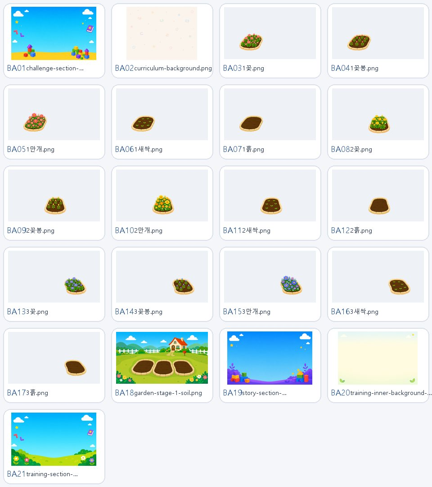

| 미리보기 | 리소스 | 크기·픽셀 | 연결 상태 | 화면·위치 | 직접 참조 | 분류·다음 검토 |
| --- | --- | ---: | --- | --- | --- | --- |
| BA01 | `backgrounds/challenge-section-background.png` | 1425.7 KiB 1586×992 | Vue 연결 확인 | 글자 학습 · 참조 스타일이 적용되는 화면 실력 도전 · 완료 실력 도전 · 코스 선택 앱 전체 · 전역 오버레이 | `src/styles/training/SkillChallengeCompleteView.css` `src/styles/training/SkillChallengeView.css` | 유지+최적화 표시 크기·차세대 포맷 검토 |
| BA02 | `backgrounds/curriculum-background.png` | 882.7 KiB 1448×1086 | Vue 연결 확인 | 글자 학습 · 문제 풀이 공통 화면 글자 학습 · 참조 스타일이 적용되는 화면 글자 학습 · 커리큘럼 경로 글자 학습 · 커리큘럼/훈련 선택 앱 전체 · 전역 오버레이 | `src/styles/training/TrainingCurriculumPath.css` `src/styles/training/TrainingLessonView.css` | 유지+최적화 표시 크기·차세대 포맷 검토 |
| BA03 | `backgrounds/garden-growth/1꽃.png` | 236.4 KiB 1672×941 | Vue 연결 확인 | 성장 정원 · 화단/이야기 친구 앱 전체 · 전역 오버레이 | `src/views/learner/GrowthView.vue` | 유지+최적화 표시 크기·차세대 포맷 검토 |
| BA04 | `backgrounds/garden-growth/1꽃봉.png` | 208.8 KiB 1672×941 | Vue 연결 확인 | 성장 정원 · 화단/이야기 친구 앱 전체 · 전역 오버레이 | `src/views/learner/GrowthView.vue` | 유지+최적화 표시 크기·차세대 포맷 검토 |
| BA05 | `backgrounds/garden-growth/1만개.png` | 267.8 KiB 1672×941 | Vue 연결 확인 | 성장 정원 · 화단/이야기 친구 앱 전체 · 전역 오버레이 | `src/views/learner/GrowthView.vue` | 유지+최적화 표시 크기·차세대 포맷 검토 |
| BA06 | `backgrounds/garden-growth/1새싹.png` | 172.9 KiB 1672×941 | Vue 연결 확인 | 성장 정원 · 화단/이야기 친구 앱 전체 · 전역 오버레이 | `src/views/learner/GrowthView.vue` | 유지+최적화 표시 크기·차세대 포맷 검토 |
| BA07 | `backgrounds/garden-growth/1흙.png` | 158.7 KiB 1672×941 | Vue 연결 확인 | 성장 정원 · 화단/이야기 친구 앱 전체 · 전역 오버레이 | `src/views/learner/GrowthView.vue` | 유지+최적화 표시 크기·차세대 포맷 검토 |
| BA08 | `backgrounds/garden-growth/2꽃.png` | 231.7 KiB 1672×941 | Vue 연결 확인 | 성장 정원 · 화단/이야기 친구 앱 전체 · 전역 오버레이 | `src/views/learner/GrowthView.vue` | 유지+최적화 표시 크기·차세대 포맷 검토 |
| BA09 | `backgrounds/garden-growth/2꽃봉.png` | 209.0 KiB 1672×941 | Vue 연결 확인 | 성장 정원 · 화단/이야기 친구 앱 전체 · 전역 오버레이 | `src/views/learner/GrowthView.vue` | 유지+최적화 표시 크기·차세대 포맷 검토 |
| BA10 | `backgrounds/garden-growth/2만개.png` | 249.9 KiB 1672×941 | Vue 연결 확인 | 성장 정원 · 화단/이야기 친구 앱 전체 · 전역 오버레이 | `src/views/learner/GrowthView.vue` | 유지+최적화 표시 크기·차세대 포맷 검토 |
| BA11 | `backgrounds/garden-growth/2새싹.png` | 173.0 KiB 1672×941 | Vue 연결 확인 | 성장 정원 · 화단/이야기 친구 앱 전체 · 전역 오버레이 | `src/views/learner/GrowthView.vue` | 유지+최적화 표시 크기·차세대 포맷 검토 |
| BA12 | `backgrounds/garden-growth/2흙.png` | 161.2 KiB 1672×941 | Vue 연결 확인 | 성장 정원 · 화단/이야기 친구 앱 전체 · 전역 오버레이 | `src/views/learner/GrowthView.vue` | 유지+최적화 표시 크기·차세대 포맷 검토 |
| BA13 | `backgrounds/garden-growth/3꽃.png` | 230.6 KiB 1672×941 | Vue 연결 확인 | 성장 정원 · 화단/이야기 친구 앱 전체 · 전역 오버레이 | `src/views/learner/GrowthView.vue` | 유지+최적화 표시 크기·차세대 포맷 검토 |
| BA14 | `backgrounds/garden-growth/3꽃봉.png` | 198.4 KiB 1672×941 | Vue 연결 확인 | 성장 정원 · 화단/이야기 친구 앱 전체 · 전역 오버레이 | `src/views/learner/GrowthView.vue` | 유지+최적화 표시 크기·차세대 포맷 검토 |
| BA15 | `backgrounds/garden-growth/3만개.png` | 256.9 KiB 1672×941 | Vue 연결 확인 | 성장 정원 · 화단/이야기 친구 앱 전체 · 전역 오버레이 | `src/views/learner/GrowthView.vue` | 유지+최적화 표시 크기·차세대 포맷 검토 |
| BA16 | `backgrounds/garden-growth/3새싹.png` | 163.6 KiB 1672×941 | Vue 연결 확인 | 성장 정원 · 화단/이야기 친구 앱 전체 · 전역 오버레이 | `src/views/learner/GrowthView.vue` | 유지+최적화 표시 크기·차세대 포맷 검토 |
| BA17 | `backgrounds/garden-growth/3흙.png` | 151.6 KiB 1672×941 | Vue 연결 확인 | 성장 정원 · 화단/이야기 친구 앱 전체 · 전역 오버레이 | `src/views/learner/GrowthView.vue` | 유지+최적화 표시 크기·차세대 포맷 검토 |
| BA18 | `backgrounds/garden-growth/garden-stage-1-soil.png` | 1668.6 KiB 1672×941 | Vue 연결 확인 | 성장 정원 · 화단/이야기 친구 앱 전체 · 전역 오버레이 | `src/views/learner/GrowthView.vue` | 유지+최적화 표시 크기·차세대 포맷 검토 |
| BA19 | `backgrounds/story-section-background.png` | 1176.5 KiB 1586×992 | Vue 연결 확인 | 앱 전체 · 전역 오버레이 이야기 나라 · 참조 스타일이 적용되는 화면 이야기 나라 · 책 선택/이어 읽기 이야기 읽기 · 장면/분기/친구 보상 | `src/styles/story/StoryReaderView.css` `src/views/learner/StorySelectionView.vue` | 유지+최적화 표시 크기·차세대 포맷 검토 |
| BA20 | `backgrounds/training-inner-background-flat-vector.png` | 1152.3 KiB 1536×1024 | Vue 연결 확인 | 글자 학습 · 참조 스타일이 적용되는 화면 글자 학습 · 커리큘럼/훈련 선택 앱 전체 · 전역 오버레이 | `src/styles/training/TrainingHomeView.css` | 유지+최적화 표시 크기·차세대 포맷 검토 |
| BA21 | `backgrounds/training-section-background.png` | 1006.7 KiB 1586×992 | Vue 연결 확인 | 글자 학습 · 문제 세트 완료 글자 학습 · 문제 풀이 공통 화면 글자 학습 · 일반/올정답 완료 글자 학습 · 참조 스타일이 적용되는 화면 글자 학습 · 커리큘럼/훈련 선택 앱 전체 · 전역 오버레이 오늘의 학습 · 전체 완료 | `src/styles/training/TodayTrainingCompleteView.css` `src/styles/training/TrainingComplete.css` `src/styles/training/TrainingHomeView.css` `src/styles/training/TrainingLessonView.css` | 유지+최적화 표시 크기·차세대 포맷 검토 |

## `base.css`

| 미리보기 | 리소스 | 크기·픽셀 | 연결 상태 | 화면·위치 | 직접 참조 | 분류·다음 검토 |
| --- | --- | ---: | --- | --- | --- | --- |
| — | `base.css` | 0.9 KiB - | 코드 참조 확인 [TBD] 최종 Vue 경로 미확인 | 코드 참조 위치 확인 필요 | `src/assets/main.css` | 검수 필요 화면 사용처 확인 |

## `battle`

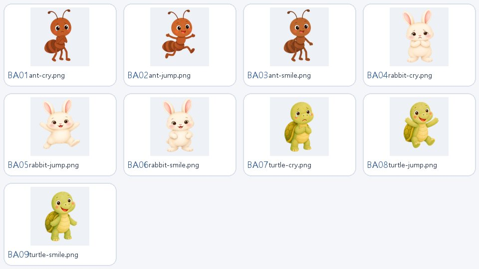

| 미리보기 | 리소스 | 크기·픽셀 | 연결 상태 | 화면·위치 | 직접 참조 | 분류·다음 검토 |
| --- | --- | ---: | --- | --- | --- | --- |
| BA01 | `battle/ant-cry.png` | 404.6 KiB 1024×1024 | Vue 연결 확인 | 글자 학습 · HangulBattle 활동 글자 학습 · 문제 풀이 공통 화면 앱 전체 · 전역 오버레이 | `src/components/training/activities/HangulBattleActivity.vue` | 다듬기 캐릭터 캔버스·비율 통일 검토 |
| BA02 | `battle/ant-jump.png` | 421.0 KiB 1024×1024 | Vue 연결 확인 | 글자 학습 · HangulBattle 활동 글자 학습 · 문제 풀이 공통 화면 앱 전체 · 전역 오버레이 | `src/components/training/activities/HangulBattleActivity.vue` | 다듬기 캐릭터 캔버스·비율 통일 검토 |
| BA03 | `battle/ant-smile.png` | 414.3 KiB 1024×1024 | Vue 연결 확인 | 글자 학습 · HangulBattle 활동 글자 학습 · 문제 풀이 공통 화면 앱 전체 · 전역 오버레이 | `src/components/training/activities/HangulBattleActivity.vue` | 다듬기 캐릭터 캔버스·비율 통일 검토 |
| BA04 | `battle/rabbit-cry.png` | 600.0 KiB 1024×1024 | Vue 연결 확인 | 글자 학습 · HangulBattle 활동 글자 학습 · 문제 풀이 공통 화면 앱 전체 · 전역 오버레이 | `src/components/training/activities/HangulBattleActivity.vue` | 다듬기 캐릭터 캔버스·비율 통일 검토 |
| BA05 | `battle/rabbit-jump.png` | 582.4 KiB 1024×1024 | Vue 연결 확인 | 글자 학습 · HangulBattle 활동 글자 학습 · 문제 풀이 공통 화면 앱 전체 · 전역 오버레이 | `src/components/training/activities/HangulBattleActivity.vue` | 다듬기 캐릭터 캔버스·비율 통일 검토 |
| BA06 | `battle/rabbit-smile.png` | 629.0 KiB 1024×1024 | Vue 연결 확인 | 글자 학습 · HangulBattle 활동 글자 학습 · 문제 풀이 공통 화면 앱 전체 · 전역 오버레이 | `src/components/training/activities/HangulBattleActivity.vue` | 다듬기 캐릭터 캔버스·비율 통일 검토 |
| BA07 | `battle/turtle-cry.png` | 683.7 KiB 1024×1024 | Vue 연결 확인 | 글자 학습 · HangulBattle 활동 글자 학습 · 문제 풀이 공통 화면 앱 전체 · 전역 오버레이 | `src/components/training/activities/HangulBattleActivity.vue` | 다듬기 캐릭터 캔버스·비율 통일 검토 |
| BA08 | `battle/turtle-jump.png` | 681.3 KiB 1024×1024 | Vue 연결 확인 | 글자 학습 · HangulBattle 활동 글자 학습 · 문제 풀이 공통 화면 앱 전체 · 전역 오버레이 | `src/components/training/activities/HangulBattleActivity.vue` | 다듬기 캐릭터 캔버스·비율 통일 검토 |
| BA09 | `battle/turtle-smile.png` | 697.7 KiB 1024×1024 | Vue 연결 확인 | 글자 학습 · HangulBattle 활동 글자 학습 · 문제 풀이 공통 화면 앱 전체 · 전역 오버레이 | `src/components/training/activities/HangulBattleActivity.vue` | 다듬기 캐릭터 캔버스·비율 통일 검토 |

## `cards`

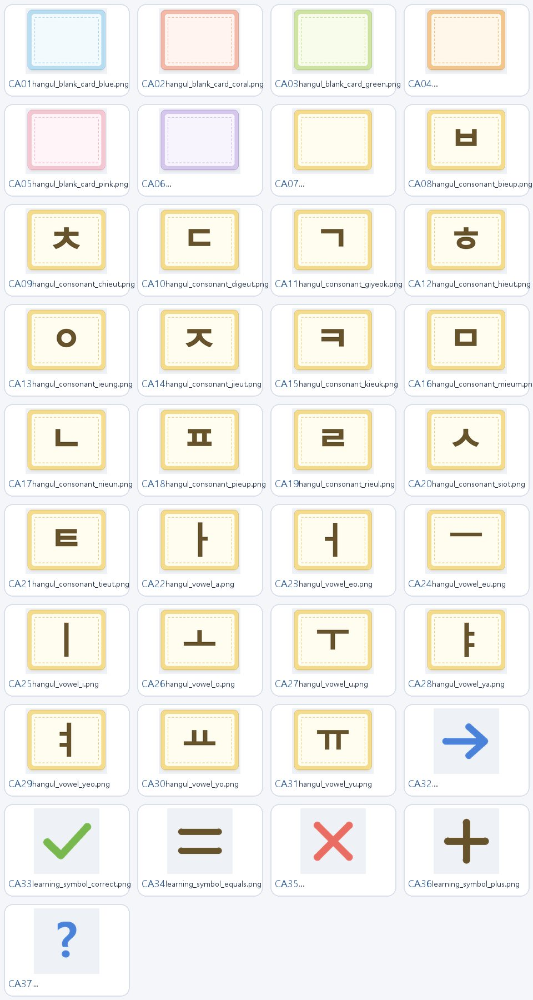

| 미리보기 | 리소스 | 크기·픽셀 | 연결 상태 | 화면·위치 | 직접 참조 | 분류·다음 검토 |
| --- | --- | ---: | --- | --- | --- | --- |
| CA01 | `cards/hangul/blanks/hangul_blank_card_blue.png` | 2.1 KiB 320×256 | [TBD] 현재 src 코드 참조 없음 | [TBD] 현재 노출 화면 확인 안 됨 예상 용도: 글자 학습 · 자모 카드 | — | 유지+검수 교육적 모양·캐릭터 일관성 검토 |
| CA02 | `cards/hangul/blanks/hangul_blank_card_coral.png` | 2.1 KiB 320×256 | [TBD] 현재 src 코드 참조 없음 | [TBD] 현재 노출 화면 확인 안 됨 예상 용도: 글자 학습 · 자모 카드 | — | 유지+검수 교육적 모양·캐릭터 일관성 검토 |
| CA03 | `cards/hangul/blanks/hangul_blank_card_green.png` | 2.1 KiB 320×256 | [TBD] 현재 src 코드 참조 없음 | [TBD] 현재 노출 화면 확인 안 됨 예상 용도: 글자 학습 · 자모 카드 | — | 유지+검수 교육적 모양·캐릭터 일관성 검토 |
| CA04 | `cards/hangul/blanks/hangul_blank_card_orange.png` | 2.1 KiB 320×256 | [TBD] 현재 src 코드 참조 없음 | [TBD] 현재 노출 화면 확인 안 됨 예상 용도: 글자 학습 · 자모 카드 | — | 유지+검수 교육적 모양·캐릭터 일관성 검토 |
| CA05 | `cards/hangul/blanks/hangul_blank_card_pink.png` | 2.1 KiB 320×256 | [TBD] 현재 src 코드 참조 없음 | [TBD] 현재 노출 화면 확인 안 됨 예상 용도: 글자 학습 · 자모 카드 | — | 유지+검수 교육적 모양·캐릭터 일관성 검토 |
| CA06 | `cards/hangul/blanks/hangul_blank_card_purple.png` | 2.1 KiB 320×256 | [TBD] 현재 src 코드 참조 없음 | [TBD] 현재 노출 화면 확인 안 됨 예상 용도: 글자 학습 · 자모 카드 | — | 유지+검수 교육적 모양·캐릭터 일관성 검토 |
| CA07 | `cards/hangul/blanks/hangul_blank_card_yellow.png` | 2.1 KiB 320×256 | [TBD] 현재 src 코드 참조 없음 | [TBD] 현재 노출 화면 확인 안 됨 예상 용도: 글자 학습 · 자모 카드 | — | 유지+검수 교육적 모양·캐릭터 일관성 검토 |
| CA08 | `cards/hangul/hangul_consonant_bieup.png` | 2.2 KiB 320×256 | Vue 연결 확인 | 글자 학습 · AudioLetterChoice 활동 글자 학습 · CardCombine 활동 글자 학습 · ListenAndSelect 활동 글자 학습 · SoundChoice 활동 글자 학습 · 문제 풀이 공통 화면 글자 학습 · 자모 카드 앱 전체 · 전역 오버레이 | `src/data/hangulCards.ts` | 유지+검수 교육적 모양·캐릭터 일관성 검토 |
| CA09 | `cards/hangul/hangul_consonant_chieut.png` | 4.5 KiB 320×256 | Vue 연결 확인 | 글자 학습 · AudioLetterChoice 활동 글자 학습 · CardCombine 활동 글자 학습 · ListenAndSelect 활동 글자 학습 · SoundChoice 활동 글자 학습 · 문제 풀이 공통 화면 글자 학습 · 자모 카드 앱 전체 · 전역 오버레이 | `src/data/hangulCards.ts` | 유지+검수 교육적 모양·캐릭터 일관성 검토 |
| CA10 | `cards/hangul/hangul_consonant_digeut.png` | 2.2 KiB 320×256 | Vue 연결 확인 | 글자 학습 · AudioLetterChoice 활동 글자 학습 · CardCombine 활동 글자 학습 · ListenAndSelect 활동 글자 학습 · SoundChoice 활동 글자 학습 · 문제 풀이 공통 화면 글자 학습 · 자모 카드 앱 전체 · 전역 오버레이 | `src/data/hangulCards.ts` | 유지+검수 교육적 모양·캐릭터 일관성 검토 |
| CA11 | `cards/hangul/hangul_consonant_giyeok.png` | 2.2 KiB 320×256 | Vue 연결 확인 | 글자 학습 · AudioLetterChoice 활동 글자 학습 · CardCombine 활동 글자 학습 · ListenAndSelect 활동 글자 학습 · SoundChoice 활동 글자 학습 · 문제 풀이 공통 화면 글자 학습 · 자모 카드 앱 전체 · 전역 오버레이 | `src/data/hangulCards.ts` | 유지+검수 교육적 모양·캐릭터 일관성 검토 |
| CA12 | `cards/hangul/hangul_consonant_hieut.png` | 4.1 KiB 320×256 | Vue 연결 확인 | 글자 학습 · AudioLetterChoice 활동 글자 학습 · CardCombine 활동 글자 학습 · ListenAndSelect 활동 글자 학습 · SoundChoice 활동 글자 학습 · 문제 풀이 공통 화면 글자 학습 · 자모 카드 앱 전체 · 전역 오버레이 | `src/data/hangulCards.ts` | 유지+검수 교육적 모양·캐릭터 일관성 검토 |
| CA13 | `cards/hangul/hangul_consonant_ieung.png` | 4.7 KiB 320×256 | Vue 연결 확인 | 글자 학습 · AudioLetterChoice 활동 글자 학습 · CardCombine 활동 글자 학습 · ListenAndSelect 활동 글자 학습 · SoundChoice 활동 글자 학습 · 문제 풀이 공통 화면 글자 학습 · 자모 카드 앱 전체 · 전역 오버레이 | `src/data/hangulCards.ts` | 유지+검수 교육적 모양·캐릭터 일관성 검토 |
| CA14 | `cards/hangul/hangul_consonant_jieut.png` | 4.4 KiB 320×256 | Vue 연결 확인 | 글자 학습 · AudioLetterChoice 활동 글자 학습 · CardCombine 활동 글자 학습 · ListenAndSelect 활동 글자 학습 · SoundChoice 활동 글자 학습 · 문제 풀이 공통 화면 글자 학습 · 자모 카드 앱 전체 · 전역 오버레이 | `src/data/hangulCards.ts` | 유지+검수 교육적 모양·캐릭터 일관성 검토 |
| CA15 | `cards/hangul/hangul_consonant_kieuk.png` | 2.2 KiB 320×256 | Vue 연결 확인 | 글자 학습 · AudioLetterChoice 활동 글자 학습 · CardCombine 활동 글자 학습 · ListenAndSelect 활동 글자 학습 · SoundChoice 활동 글자 학습 · 문제 풀이 공통 화면 글자 학습 · 자모 카드 앱 전체 · 전역 오버레이 | `src/data/hangulCards.ts` | 유지+검수 교육적 모양·캐릭터 일관성 검토 |
| CA16 | `cards/hangul/hangul_consonant_mieum.png` | 2.2 KiB 320×256 | Vue 연결 확인 | 글자 학습 · AudioLetterChoice 활동 글자 학습 · CardCombine 활동 글자 학습 · ListenAndSelect 활동 글자 학습 · SoundChoice 활동 글자 학습 · 문제 풀이 공통 화면 글자 학습 · 자모 카드 앱 전체 · 전역 오버레이 | `src/data/hangulCards.ts` | 유지+검수 교육적 모양·캐릭터 일관성 검토 |
| CA17 | `cards/hangul/hangul_consonant_nieun.png` | 2.2 KiB 320×256 | Vue 연결 확인 | 글자 학습 · AudioLetterChoice 활동 글자 학습 · CardCombine 활동 글자 학습 · ListenAndSelect 활동 글자 학습 · SoundChoice 활동 글자 학습 · 문제 풀이 공통 화면 글자 학습 · 자모 카드 앱 전체 · 전역 오버레이 | `src/data/hangulCards.ts` | 유지+검수 교육적 모양·캐릭터 일관성 검토 |
| CA18 | `cards/hangul/hangul_consonant_pieup.png` | 2.3 KiB 320×256 | Vue 연결 확인 | 글자 학습 · AudioLetterChoice 활동 글자 학습 · CardCombine 활동 글자 학습 · ListenAndSelect 활동 글자 학습 · SoundChoice 활동 글자 학습 · 문제 풀이 공통 화면 글자 학습 · 자모 카드 앱 전체 · 전역 오버레이 | `src/data/hangulCards.ts` | 유지+검수 교육적 모양·캐릭터 일관성 검토 |
| CA19 | `cards/hangul/hangul_consonant_rieul.png` | 2.2 KiB 320×256 | Vue 연결 확인 | 글자 학습 · AudioLetterChoice 활동 글자 학습 · CardCombine 활동 글자 학습 · ListenAndSelect 활동 글자 학습 · SoundChoice 활동 글자 학습 · 문제 풀이 공통 화면 글자 학습 · 자모 카드 앱 전체 · 전역 오버레이 | `src/data/hangulCards.ts` | 유지+검수 교육적 모양·캐릭터 일관성 검토 |
| CA20 | `cards/hangul/hangul_consonant_siot.png` | 4.4 KiB 320×256 | Vue 연결 확인 | 글자 학습 · AudioLetterChoice 활동 글자 학습 · CardCombine 활동 글자 학습 · ListenAndSelect 활동 글자 학습 · SoundChoice 활동 글자 학습 · 문제 풀이 공통 화면 글자 학습 · 자모 카드 앱 전체 · 전역 오버레이 | `src/data/hangulCards.ts` | 유지+검수 교육적 모양·캐릭터 일관성 검토 |
| CA21 | `cards/hangul/hangul_consonant_tieut.png` | 2.2 KiB 320×256 | Vue 연결 확인 | 글자 학습 · AudioLetterChoice 활동 글자 학습 · CardCombine 활동 글자 학습 · ListenAndSelect 활동 글자 학습 · SoundChoice 활동 글자 학습 · 문제 풀이 공통 화면 글자 학습 · 자모 카드 앱 전체 · 전역 오버레이 | `src/data/hangulCards.ts` | 유지+검수 교육적 모양·캐릭터 일관성 검토 |
| CA22 | `cards/hangul/hangul_vowel_a.png` | 2.2 KiB 320×256 | Vue 연결 확인 | 글자 학습 · AudioLetterChoice 활동 글자 학습 · CardCombine 활동 글자 학습 · ListenAndSelect 활동 글자 학습 · SoundChoice 활동 글자 학습 · 문제 풀이 공통 화면 글자 학습 · 자모 카드 앱 전체 · 전역 오버레이 | `src/data/hangulCards.ts` | 유지+검수 교육적 모양·캐릭터 일관성 검토 |
| CA23 | `cards/hangul/hangul_vowel_eo.png` | 2.2 KiB 320×256 | Vue 연결 확인 | 글자 학습 · AudioLetterChoice 활동 글자 학습 · CardCombine 활동 글자 학습 · ListenAndSelect 활동 글자 학습 · SoundChoice 활동 글자 학습 · 문제 풀이 공통 화면 글자 학습 · 자모 카드 앱 전체 · 전역 오버레이 | `src/data/hangulCards.ts` | 유지+검수 교육적 모양·캐릭터 일관성 검토 |
| CA24 | `cards/hangul/hangul_vowel_eu.png` | 2.1 KiB 320×256 | Vue 연결 확인 | 글자 학습 · AudioLetterChoice 활동 글자 학습 · CardCombine 활동 글자 학습 · ListenAndSelect 활동 글자 학습 · SoundChoice 활동 글자 학습 · 문제 풀이 공통 화면 글자 학습 · 자모 카드 앱 전체 · 전역 오버레이 | `src/data/hangulCards.ts` | 유지+검수 교육적 모양·캐릭터 일관성 검토 |
| CA25 | `cards/hangul/hangul_vowel_i.png` | 2.1 KiB 320×256 | Vue 연결 확인 | 글자 학습 · AudioLetterChoice 활동 글자 학습 · CardCombine 활동 글자 학습 · ListenAndSelect 활동 글자 학습 · SoundChoice 활동 글자 학습 · 문제 풀이 공통 화면 글자 학습 · 자모 카드 앱 전체 · 전역 오버레이 | `src/data/hangulCards.ts` | 유지+검수 교육적 모양·캐릭터 일관성 검토 |
| CA26 | `cards/hangul/hangul_vowel_o.png` | 2.2 KiB 320×256 | Vue 연결 확인 | 글자 학습 · AudioLetterChoice 활동 글자 학습 · CardCombine 활동 글자 학습 · ListenAndSelect 활동 글자 학습 · SoundChoice 활동 글자 학습 · 문제 풀이 공통 화면 글자 학습 · 자모 카드 앱 전체 · 전역 오버레이 | `src/data/hangulCards.ts` | 유지+검수 교육적 모양·캐릭터 일관성 검토 |
| CA27 | `cards/hangul/hangul_vowel_u.png` | 2.2 KiB 320×256 | Vue 연결 확인 | 글자 학습 · AudioLetterChoice 활동 글자 학습 · CardCombine 활동 글자 학습 · ListenAndSelect 활동 글자 학습 · SoundChoice 활동 글자 학습 · 문제 풀이 공통 화면 글자 학습 · 자모 카드 앱 전체 · 전역 오버레이 | `src/data/hangulCards.ts` | 유지+검수 교육적 모양·캐릭터 일관성 검토 |
| CA28 | `cards/hangul/hangul_vowel_ya.png` | 2.2 KiB 320×256 | Vue 연결 확인 | 글자 학습 · AudioLetterChoice 활동 글자 학습 · CardCombine 활동 글자 학습 · ListenAndSelect 활동 글자 학습 · SoundChoice 활동 글자 학습 · 문제 풀이 공통 화면 글자 학습 · 자모 카드 앱 전체 · 전역 오버레이 | `src/data/hangulCards.ts` | 유지+검수 교육적 모양·캐릭터 일관성 검토 |
| CA29 | `cards/hangul/hangul_vowel_yeo.png` | 2.2 KiB 320×256 | Vue 연결 확인 | 글자 학습 · AudioLetterChoice 활동 글자 학습 · CardCombine 활동 글자 학습 · ListenAndSelect 활동 글자 학습 · SoundChoice 활동 글자 학습 · 문제 풀이 공통 화면 글자 학습 · 자모 카드 앱 전체 · 전역 오버레이 | `src/data/hangulCards.ts` | 유지+검수 교육적 모양·캐릭터 일관성 검토 |
| CA30 | `cards/hangul/hangul_vowel_yo.png` | 2.2 KiB 320×256 | Vue 연결 확인 | 글자 학습 · AudioLetterChoice 활동 글자 학습 · CardCombine 활동 글자 학습 · ListenAndSelect 활동 글자 학습 · SoundChoice 활동 글자 학습 · 문제 풀이 공통 화면 글자 학습 · 자모 카드 앱 전체 · 전역 오버레이 | `src/data/hangulCards.ts` | 유지+검수 교육적 모양·캐릭터 일관성 검토 |
| CA31 | `cards/hangul/hangul_vowel_yu.png` | 2.2 KiB 320×256 | Vue 연결 확인 | 글자 학습 · AudioLetterChoice 활동 글자 학습 · CardCombine 활동 글자 학습 · ListenAndSelect 활동 글자 학습 · SoundChoice 활동 글자 학습 · 문제 풀이 공통 화면 글자 학습 · 자모 카드 앱 전체 · 전역 오버레이 | `src/data/hangulCards.ts` | 유지+검수 교육적 모양·캐릭터 일관성 검토 |
| CA32 | `cards/symbols/learning_symbol_arrow_right.png` | 1.2 KiB 256×256 | [TBD] 현재 src 코드 참조 없음 | [TBD] 현재 노출 화면 확인 안 됨 예상 용도: 코드 참조 위치 확인 필요 | — | 유지+검수 교육적 모양·캐릭터 일관성 검토 |
| CA33 | `cards/symbols/learning_symbol_correct.png` | 1.4 KiB 256×256 | [TBD] 현재 src 코드 참조 없음 | [TBD] 현재 노출 화면 확인 안 됨 예상 용도: 코드 참조 위치 확인 필요 | — | 유지+검수 교육적 모양·캐릭터 일관성 검토 |
| CA34 | `cards/symbols/learning_symbol_equals.png` | 0.7 KiB 256×256 | [TBD] 현재 src 코드 참조 없음 | [TBD] 현재 노출 화면 확인 안 됨 예상 용도: 코드 참조 위치 확인 필요 | — | 유지+검수 교육적 모양·캐릭터 일관성 검토 |
| CA35 | `cards/symbols/learning_symbol_incorrect.png` | 1.7 KiB 256×256 | [TBD] 현재 src 코드 참조 없음 | [TBD] 현재 노출 화면 확인 안 됨 예상 용도: 코드 참조 위치 확인 필요 | — | 유지+검수 교육적 모양·캐릭터 일관성 검토 |
| CA36 | `cards/symbols/learning_symbol_plus.png` | 1.0 KiB 256×256 | [TBD] 현재 src 코드 참조 없음 | [TBD] 현재 노출 화면 확인 안 됨 예상 용도: 코드 참조 위치 확인 필요 | — | 유지+검수 교육적 모양·캐릭터 일관성 검토 |
| CA37 | `cards/symbols/learning_symbol_question.png` | 2.7 KiB 256×256 | [TBD] 현재 src 코드 참조 없음 | [TBD] 현재 노출 화면 확인 안 됨 예상 용도: 코드 참조 위치 확인 필요 | — | 유지+검수 교육적 모양·캐릭터 일관성 검토 |

## `challenge`

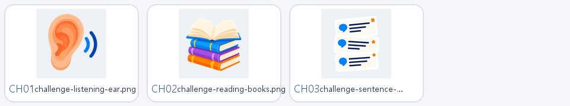

| 미리보기 | 리소스 | 크기·픽셀 | 연결 상태 | 화면·위치 | 직접 참조 | 분류·다음 검토 |
| --- | --- | ---: | --- | --- | --- | --- |
| CH01 | `challenge/challenge-listening-ear.png` | 485.9 KiB 1254×1254 | Vue 연결 확인 | 실력 도전 · 코스 선택 앱 전체 · 전역 오버레이 | `src/views/learner/SkillChallengeView.vue` | 다듬기 메인 섬 팔레트·배치 검토 |
| CH02 | `challenge/challenge-reading-books.png` | 769.5 KiB 1254×1254 | Vue 연결 확인 | 실력 도전 · 코스 선택 앱 전체 · 전역 오버레이 | `src/views/learner/SkillChallengeView.vue` | 다듬기 메인 섬 팔레트·배치 검토 |
| CH03 | `challenge/challenge-sentence-cards.png` | 575.3 KiB 1254×1254 | Vue 연결 확인 | 실력 도전 · 코스 선택 앱 전체 · 전역 오버레이 | `src/views/learner/SkillChallengeView.vue` | 다듬기 메인 섬 팔레트·배치 검토 |

## `characters`

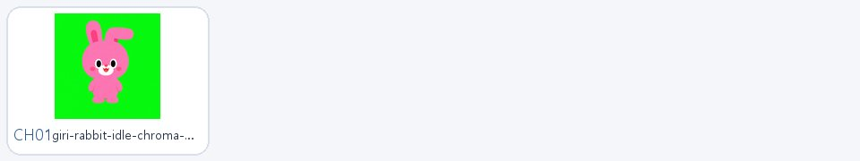

| 미리보기 | 리소스 | 크기·픽셀 | 연결 상태 | 화면·위치 | 직접 참조 | 분류·다음 검토 |
| --- | --- | ---: | --- | --- | --- | --- |
| CH01 | `characters/giri-rabbit-idle-chroma-reference.png` | 1059.3 KiB 1254×1254 | [TBD] 현재 src 코드 참조 없음 | [TBD] 현재 노출 화면 확인 안 됨 예상 용도: 글자 학습 · 활동/안내 캐릭터 | — | 유지+검수 교육적 모양·캐릭터 일관성 검토 |

## `fonts`

| 미리보기 | 리소스 | 크기·픽셀 | 연결 상태 | 화면·위치 | 직접 참조 | 분류·다음 검토 |
| --- | --- | ---: | --- | --- | --- | --- |
| — | `fonts/PeachMarket-Regular.ttf` | 1249.0 KiB - | Vue 연결 확인 | 앱 전체 · 전역 오버레이 | `src/styles/common/tokens.css` | 유지 전체 아동 화면 글꼴 |

## `growth`

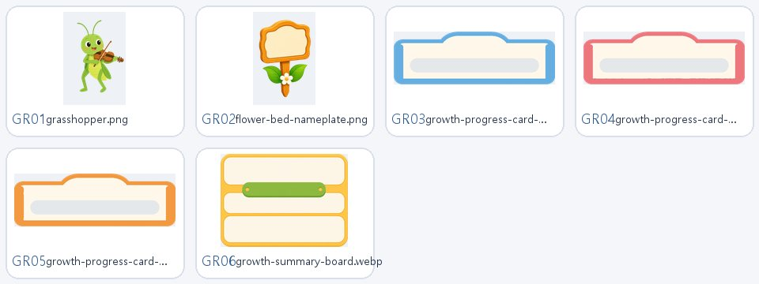

| 미리보기 | 리소스 | 크기·픽셀 | 연결 상태 | 화면·위치 | 직접 참조 | 분류·다음 검토 |
| --- | --- | ---: | --- | --- | --- | --- |
| GR01 | `growth/characters/grasshopper.png` | 549.0 KiB 1024×1536 | [TBD] 현재 src 코드 참조 없음 | [TBD] 현재 노출 화면 확인 안 됨 예상 용도: 성장 정원 · 화단 이름표/장식 | — | 다듬기 메인 섬 팔레트·배치 검토 |
| GR02 | `growth/ui/flower-bed-nameplate.png` | 857.3 KiB 1024×1536 | [TBD] 현재 src 코드 참조 없음 | [TBD] 현재 노출 화면 확인 안 됨 예상 용도: 성장 정원 · 화단 이름표/장식 | — | 다듬기 메인 섬 팔레트·배치 검토 |
| GR03 | `growth/ui/growth-progress-card-fluency.webp` | 3.1 KiB 640×210 | Vue 연결 확인 | 성장 정원 · 화단/이야기 친구 앱 전체 · 전역 오버레이 | `src/views/learner/GrowthView.vue` | 다듬기 메인 섬 팔레트·배치 검토 |
| GR04 | `growth/ui/growth-progress-card-phonics.webp` | 3.2 KiB 640×210 | Vue 연결 확인 | 성장 정원 · 화단/이야기 친구 앱 전체 · 전역 오버레이 | `src/views/learner/GrowthView.vue` | 다듬기 메인 섬 팔레트·배치 검토 |
| GR05 | `growth/ui/growth-progress-card-reading.webp` | 2.7 KiB 640×210 | Vue 연결 확인 | 성장 정원 · 화단/이야기 친구 앱 전체 · 전역 오버레이 | `src/views/learner/GrowthView.vue` | 다듬기 메인 섬 팔레트·배치 검토 |
| GR06 | `growth/ui/growth-summary-board.webp` | 147.5 KiB 600×440 | Vue 연결 확인 | 성장 정원 · 화단/이야기 친구 앱 전체 · 전역 오버레이 | `src/views/learner/GrowthView.vue` | 다듬기 메인 섬 팔레트·배치 검토 |

## `header`

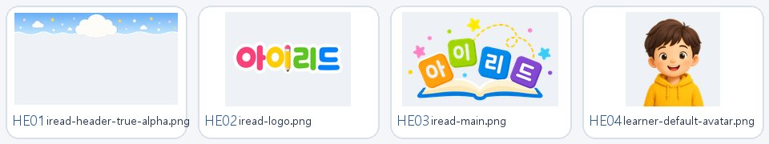

| 미리보기 | 리소스 | 크기·픽셀 | 연결 상태 | 화면·위치 | 직접 참조 | 분류·다음 검토 |
| --- | --- | ---: | --- | --- | --- | --- |
| HE01 | `header/iread-header-true-alpha.png` | 866.1 KiB 1672×941 | Vue 연결 확인 | 로그인 이후 모든 아동 화면 · 공통 레이아웃 로그인 이후 모든 아동 화면 · 상단 헤더 앱 전체 · 전역 오버레이 | `src/components/layout/LearnerHeader.vue` | 유지+최적화 공통 UI 표시 크기 검토 |
| HE02 | `header/iread-logo.png` | 381.2 KiB 1448×1086 | [TBD] 현재 src 코드 참조 없음 | [TBD] 현재 노출 화면 확인 안 됨 예상 용도: 로그인 이후 모든 아동 화면 · 상단 헤더 | — | 유지+최적화 공통 UI 표시 크기 검토 |
| HE03 | `header/iread-main.png` | 900.6 KiB 1026×621 | Vue 연결 확인 | 로그인 이후 모든 아동 화면 · 공통 레이아웃 로그인 이후 모든 아동 화면 · 상단 헤더 아동 로그인 · 계정 입력/아동 선택 앱 전체 · 전역 오버레이 | `src/components/layout/LearnerHeader.vue` `src/views/learner/LearnerLoginView.vue` | 유지+최적화 공통 UI 표시 크기 검토 |
| HE04 | `header/learner-default-avatar.png` | 55.7 KiB 256×256 | Vue 연결 확인 | 로그인 이후 모든 아동 화면 · 공통 레이아웃 로그인 이후 모든 아동 화면 · 상단 헤더 앱 전체 · 전역 오버레이 | `src/components/layout/LearnerHeader.vue` | 유지+최적화 공통 UI 표시 크기 검토 |

## `icons`

| 미리보기 | 리소스 | 크기·픽셀 | 연결 상태 | 화면·위치 | 직접 참조 | 분류·다음 검토 |
| --- | --- | ---: | --- | --- | --- | --- |
|  | `icons/arrow-back.svg` | 0.2 KiB - | Vue 연결 확인 | 글자 학습 · 문제 풀이 공통 화면 아동 상세 화면 · 공통 뒤로가기 앱 전체 · 전역 오버레이 이야기 나라 · 책 선택/이어 읽기 이야기 읽기 · 장면/분기/친구 보상 | `src/components/common/PageBackButton.vue` | 유지 공통 의미 아이콘 |
|  | `icons/arrow-right.svg` | 0.2 KiB - | Vue 연결 확인 | 글자 학습 · SoundManipulation 활동 글자 학습 · SoundOmit 활동 글자 학습 · 문제 풀이 공통 화면 글자 학습 · 커리큘럼/훈련 선택 글자 학습 · 훈련 목록 모달 글자 학습 · 훈련 목록 카드 글자 학습 · 훈련 시작 실력 도전 · 코스 선택 앱 전체 · 전역 오버레이 이야기 읽기 · 장면/분기/친구 보상 | `src/components/training/activities/SoundManipulationActivity.vue` `src/components/training/activities/SoundOmitActivity.vue` `src/components/training/TrainingIntro.vue` `src/components/training/TrainingLessonCard.vue` `외 2개` | 유지 공통 의미 아이콘 |
|  | `icons/check.svg` | 0.2 KiB - | Vue 연결 확인 | 글자 학습 · ReadAloud 활동 글자 학습 · WordReadingGrid 활동 글자 학습 · 문제 풀이 공통 화면 글자 학습 · 커리큘럼 경로 글자 학습 · 커리큘럼/훈련 선택 글자 학습 · 훈련 목록 모달 글자 학습 · 훈련 목록 카드 성장 정원 · 화단/이야기 친구 앱 전체 · 전역 오버레이 | `src/components/training/activities/ReadAloudActivity.vue` `src/components/training/activities/WordReadingGridActivity.vue` `src/components/training/TrainingCurriculumPath.vue` `src/components/training/TrainingLessonCard.vue` `외 1개` | 유지 공통 의미 아이콘 |
|  | `icons/close.svg` | 0.2 KiB - | Vue 연결 확인 | 글자 학습 · SoundOmit 활동 글자 학습 · 문제 풀이 공통 화면 글자 학습 · 커리큘럼/훈련 선택 글자 학습 · 훈련 목록 모달 성장 정원 · 이야기 친구 모달 성장 정원 · 화단/이야기 친구 앱 전체 · 전역 오버레이 | `src/components/growth/StoryFriendCollectionModal.vue` `src/components/training/activities/SoundOmitActivity.vue` `src/components/training/TrainingLessonModal.vue` | 유지 공통 의미 아이콘 |
|  | `icons/drag-handle.svg` | 0.3 KiB - | Vue 연결 확인 | 글자 학습 · FillBlank 활동 글자 학습 · SentenceChoice 활동 글자 학습 · SentenceOrder 활동 글자 학습 · 문제 풀이 공통 화면 앱 전체 · 전역 오버레이 | `src/components/training/activities/FillBlankActivity.vue` `src/components/training/activities/SentenceChoiceActivity.vue` `src/components/training/activities/SentenceOrderActivity.vue` | 유지 공통 의미 아이콘 |
|  | `icons/exit.svg` | 0.5 KiB - | Vue 연결 확인 | 로그인 이후 모든 아동 화면 · 공통 레이아웃 로그인 이후 모든 아동 화면 · 상단 헤더 앱 전체 · 전역 오버레이 | `src/components/layout/LearnerHeader.vue` | 유지 공통 의미 아이콘 |
|  | `icons/eye-tracker.svg` | 0.5 KiB - | Vue 연결 확인 | 글자 학습 · 문제 풀이 공통 화면 로그인 이후 모든 아동 화면 · 공통 레이아웃 로그인 이후 모든 아동 화면 · 상단 헤더 앱 전체 · 전역 오버레이 | `src/components/layout/LearnerHeader.vue` `src/views/learner/TrainingLessonView.vue` | 유지 공통 의미 아이콘 |
|  | `icons/lock.svg` | 0.3 KiB - | Vue 연결 확인 | 아동 로그인 · 계정 입력/아동 선택 앱 전체 · 전역 오버레이 | `src/views/learner/LearnerLoginView.vue` | 유지 공통 의미 아이콘 |
|  | `icons/microphone.svg` | 0.3 KiB - | Vue 연결 확인 | 글자 학습 · ReadAloud 활동 글자 학습 · 문제 풀이 공통 화면 로그인 이후 모든 아동 화면 · 공통 레이아웃 로그인 이후 모든 아동 화면 · 상단 헤더 앱 전체 · 전역 오버레이 이야기 읽기 · 장면/분기/친구 보상 | `src/components/layout/LearnerHeader.vue` `src/components/training/activities/ReadAloudActivity.vue` `src/views/learner/StoryReaderView.vue` `src/views/learner/TrainingLessonView.vue` | 유지 공통 의미 아이콘 |
|  | `icons/pending.svg` | 0.2 KiB - | Vue 연결 확인 | 글자 학습 · 커리큘럼/훈련 선택 글자 학습 · 훈련 목록 모달 글자 학습 · 훈련 목록 카드 앱 전체 · 전역 오버레이 | `src/components/training/TrainingLessonCard.vue` | 유지 공통 의미 아이콘 |
|  | `icons/reading-active.svg` | 0.3 KiB - | Vue 연결 확인 | 글자 학습 · FillBlank 활동 글자 학습 · GazeTrace 활동 글자 학습 · SentenceChoice 활동 글자 학습 · SentenceOrder 활동 글자 학습 · SentenceReading 활동 글자 학습 · WordReadingGrid 활동 글자 학습 · 문제 풀이 공통 화면 앱 전체 · 전역 오버레이 | `src/components/training/activities/FillBlankActivity.vue` `src/components/training/activities/GazeTraceActivity.vue` `src/components/training/activities/SentenceChoiceActivity.vue` `src/components/training/activities/SentenceOrderActivity.vue` `외 2개` | 유지 공통 의미 아이콘 |
|  | `icons/resource-placeholder.svg` | 0.3 KiB - | Vue 연결 확인 | 글자 학습 · AudioLetterChoice 활동 글자 학습 · CardCombine 활동 글자 학습 · ListenAndSelect 활동 글자 학습 · SentenceChoice 활동 글자 학습 · SoundChoice 활동 글자 학습 · 누락 리소스 자리 글자 학습 · 문제 풀이 공통 화면 글자 학습 · 자모 카드 앱 전체 · 전역 오버레이 | `src/components/training/ResourceRequired.vue` | 유지 공통 의미 아이콘 |
|  | `icons/sound-listen.svg` | 0.3 KiB - | Vue 연결 확인 | 글자 학습 · AudioLetterChoice 활동 글자 학습 · GazeTrace 활동 글자 학습 · HangulBattle 활동 글자 학습 · LetterBuild 활동 글자 학습 · ListenAndSelect 활동 글자 학습 · ReadAloud 활동 글자 학습 · SoundBuild 활동 글자 학습 · SoundChoice 활동 글자 학습 · SoundManipulation 활동 글자 학습 · SoundOmit 활동 글자 학습 · 문제 풀이 공통 화면 소리가 있는 모든 학습 · 듣기/재생/다시 듣기 앱 전체 · 전역 오버레이 | `src/components/training/activities/ListenAndSelectActivity.vue` `src/components/training/activities/SoundBuildActivity.vue` `src/components/training/SoundButton.vue` | 유지 공통 의미 아이콘 |
|  | `icons/sound-playing.svg` | 0.3 KiB - | Vue 연결 확인 | 글자 학습 · AudioLetterChoice 활동 글자 학습 · GazeTrace 활동 글자 학습 · HangulBattle 활동 글자 학습 · LetterBuild 활동 글자 학습 · ListenAndSelect 활동 글자 학습 · ReadAloud 활동 글자 학습 · SoundBuild 활동 글자 학습 · SoundChoice 활동 글자 학습 · SoundManipulation 활동 글자 학습 · SoundOmit 활동 글자 학습 · 문제 풀이 공통 화면 소리가 있는 모든 학습 · 듣기/재생/다시 듣기 앱 전체 · 전역 오버레이 | `src/components/training/SoundButton.vue` | 유지 공통 의미 아이콘 |
|  | `icons/sound-replay.svg` | 0.4 KiB - | Vue 연결 확인 | 글자 학습 · AudioLetterChoice 활동 글자 학습 · GazeTrace 활동 글자 학습 · HangulBattle 활동 글자 학습 · LetterBuild 활동 글자 학습 · ListenAndSelect 활동 글자 학습 · ReadAloud 활동 글자 학습 · SoundBuild 활동 글자 학습 · SoundChoice 활동 글자 학습 · SoundManipulation 활동 글자 학습 · SoundOmit 활동 글자 학습 · 문제 풀이 공통 화면 소리가 있는 모든 학습 · 듣기/재생/다시 듣기 앱 전체 · 전역 오버레이 | `src/components/training/SoundButton.vue` | 유지 공통 의미 아이콘 |
|  | `icons/stop.svg` | 0.1 KiB - | Vue 연결 확인 | 글자 학습 · ReadAloud 활동 글자 학습 · 문제 풀이 공통 화면 앱 전체 · 전역 오버레이 | `src/components/training/activities/ReadAloudActivity.vue` | 유지 공통 의미 아이콘 |
|  | `icons/user.svg` | 0.3 KiB - | Vue 연결 확인 | 아동 로그인 · 계정 입력/아동 선택 앱 전체 · 전역 오버레이 | `src/views/learner/LearnerLoginView.vue` | 유지 공통 의미 아이콘 |

## `main.css`

| 미리보기 | 리소스 | 크기·픽셀 | 연결 상태 | 화면·위치 | 직접 참조 | 분류·다음 검토 |
| --- | --- | ---: | --- | --- | --- | --- |
| — | `main.css` | 14.5 KiB - | [TBD] 현재 src 코드 참조 없음 | [TBD] 현재 노출 화면 확인 안 됨 예상 용도: 코드 참조 위치 확인 필요 | — | 검수 필요 화면 사용처 확인 |

## `map`

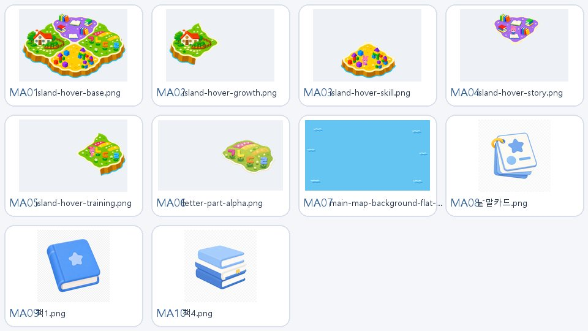

| 미리보기 | 리소스 | 크기·픽셀 | 연결 상태 | 화면·위치 | 직접 참조 | 분류·다음 검토 |
| --- | --- | ---: | --- | --- | --- | --- |
| MA01 | `map/island-hover-base.png` | 1175.6 KiB 1536×1024 | Vue 연결 확인 | 메인 섬 · 메뉴 섬 메인 섬 · 메뉴 지도 앱 전체 · 전역 오버레이 | `src/components/IslandMap.vue` | 유지+최적화 표시 크기·차세대 포맷 검토 |
| MA02 | `map/island-hover-growth.png` | 389.4 KiB 1536×1024 | Vue 연결 확인 | 메인 섬 · 메뉴 섬 메인 섬 · 메뉴 지도 앱 전체 · 전역 오버레이 | `src/components/IslandMap.vue` | 유지+최적화 표시 크기·차세대 포맷 검토 |
| MA03 | `map/island-hover-skill.png` | 371.8 KiB 1536×1024 | Vue 연결 확인 | 메인 섬 · 메뉴 섬 메인 섬 · 메뉴 지도 앱 전체 · 전역 오버레이 | `src/components/IslandMap.vue` | 유지+최적화 표시 크기·차세대 포맷 검토 |
| MA04 | `map/island-hover-story.png` | 302.4 KiB 1536×1024 | Vue 연결 확인 | 메인 섬 · 메뉴 섬 메인 섬 · 메뉴 지도 앱 전체 · 전역 오버레이 | `src/components/IslandMap.vue` | 유지+최적화 표시 크기·차세대 포맷 검토 |
| MA05 | `map/island-hover-training.png` | 340.8 KiB 1536×1024 | Vue 연결 확인 | 메인 섬 · 메뉴 섬 메인 섬 · 메뉴 지도 앱 전체 · 전역 오버레이 | `src/components/IslandMap.vue` | 유지+최적화 표시 크기·차세대 포맷 검토 |
| MA06 | `map/letter-part-alpha.png` | 1330.9 KiB 1673×940 | Vue 연결 확인 | 글자 학습 · 문제 풀이 공통 화면 글자 학습 · 일반/올정답 완료 글자 학습 · 커리큘럼/훈련 선택 실력 도전 · 완료 실력 도전 · 코스 선택 앱 전체 · 전역 오버레이 | `src/mocks/trainingCategories.ts` | 유지+최적화 표시 크기·차세대 포맷 검토 |
| MA07 | `map/main-map-background-flat-waves-v2.png` | 19.6 KiB 1920×1080 | Vue 연결 확인 | 메인 섬 · 메뉴 지도 앱 전체 · 전역 오버레이 | `src/views/learner/LearnerHomeView.vue` | 유지+최적화 표시 크기·차세대 포맷 검토 |
| MA08 | `map/낱말카드.png` | 1178.1 KiB 1254×1254 | Vue 연결 확인 | 글자 학습 · 문제 풀이 공통 화면 글자 학습 · 일반/올정답 완료 글자 학습 · 커리큘럼/훈련 선택 실력 도전 · 완료 실력 도전 · 코스 선택 앱 전체 · 전역 오버레이 | `src/mocks/trainingCategories.ts` | 유지+최적화 표시 크기·차세대 포맷 검토 |
| MA09 | `map/책1.png` | 1082.1 KiB 1254×1254 | Vue 연결 확인 | 글자 학습 · 문제 풀이 공통 화면 글자 학습 · 일반/올정답 완료 글자 학습 · 커리큘럼/훈련 선택 실력 도전 · 완료 실력 도전 · 코스 선택 앱 전체 · 전역 오버레이 | `src/mocks/trainingCategories.ts` | 유지+최적화 표시 크기·차세대 포맷 검토 |
| MA10 | `map/책4.png` | 1048.0 KiB 1254×1254 | Vue 연결 확인 | 글자 학습 · 문제 풀이 공통 화면 글자 학습 · 일반/올정답 완료 글자 학습 · 커리큘럼/훈련 선택 실력 도전 · 완료 실력 도전 · 코스 선택 앱 전체 · 전역 오버레이 | `src/mocks/trainingCategories.ts` | 유지+최적화 표시 크기·차세대 포맷 검토 |

## `navigation`

| 미리보기 | 리소스 | 크기·픽셀 | 연결 상태 | 화면·위치 | 직접 참조 | 분류·다음 검토 |
| --- | --- | ---: | --- | --- | --- | --- |
|  | `navigation/training-arrow-left.svg` | 0.6 KiB - | Vue 연결 확인 | 글자 학습 · 커리큘럼 경로 글자 학습 · 커리큘럼/훈련 선택 앱 전체 · 전역 오버레이 | `src/components/training/TrainingCurriculumPath.vue` | 유지+최적화 공통 UI 표시 크기 검토 |
|  | `navigation/training-arrow-right.svg` | 0.6 KiB - | Vue 연결 확인 | 글자 학습 · 커리큘럼 경로 글자 학습 · 커리큘럼/훈련 선택 앱 전체 · 전역 오버레이 | `src/components/training/TrainingCurriculumPath.vue` | 유지+최적화 공통 UI 표시 크기 검토 |

## `sentence-match`

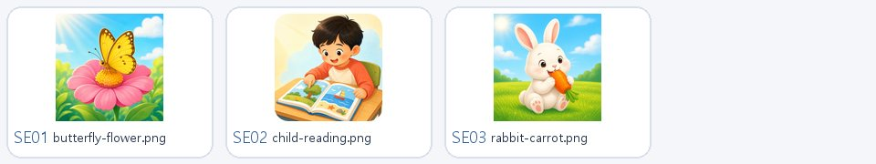

| 미리보기 | 리소스 | 크기·픽셀 | 연결 상태 | 화면·위치 | 직접 참조 | 분류·다음 검토 |
| --- | --- | ---: | --- | --- | --- | --- |
| SE01 | `sentence-match/butterfly-flower.png` | 1884.0 KiB 1254×1254 | Vue 연결 확인 | 글자 학습 · 문제 풀이 공통 화면 글자 학습 · 일반/올정답 완료 글자 학습 · 커리큘럼/훈련 선택 실력 도전 · 완료 실력 도전 · 코스 선택 앱 전체 · 전역 오버레이 | `src/mocks/pictureSentenceLessons.ts` | 검수 필요 화면 사용처 확인 |
| SE02 | `sentence-match/child-reading.png` | 2143.6 KiB 1254×1254 | Vue 연결 확인 | 글자 학습 · 문제 풀이 공통 화면 글자 학습 · 일반/올정답 완료 글자 학습 · 커리큘럼/훈련 선택 실력 도전 · 완료 실력 도전 · 코스 선택 앱 전체 · 전역 오버레이 | `src/mocks/pictureSentenceLessons.ts` | 검수 필요 화면 사용처 확인 |
| SE03 | `sentence-match/rabbit-carrot.png` | 1896.0 KiB 1254×1254 | Vue 연결 확인 | 글자 학습 · 문제 풀이 공통 화면 글자 학습 · 일반/올정답 완료 글자 학습 · 커리큘럼/훈련 선택 실력 도전 · 완료 실력 도전 · 코스 선택 앱 전체 · 전역 오버레이 | `src/mocks/pictureSentenceLessons.ts` | 검수 필요 화면 사용처 확인 |

## `story`

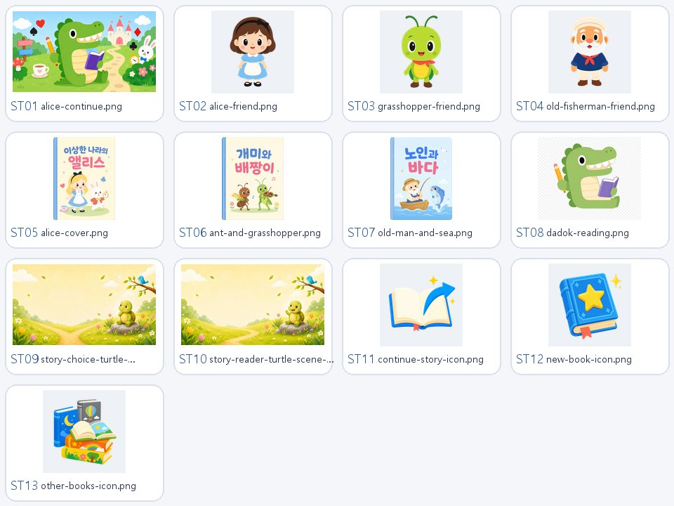

| 미리보기 | 리소스 | 크기·픽셀 | 연결 상태 | 화면·위치 | 직접 참조 | 분류·다음 검토 |
| --- | --- | ---: | --- | --- | --- | --- |
| ST01 | `story/alice-continue.png` | 1571.6 KiB 1672×941 | Vue 연결 확인 | 앱 전체 · 전역 오버레이 이야기 나라 · 책 선택/이어 읽기 | `src/views/learner/StorySelectionView.vue` | 다듬기 동일 인물·화풍 일관성 검토 |
| ST02 | `story/characters/alice-friend.png` | 505.4 KiB 1254×1254 | Vue 연결 확인 | 성장 정원 · 화단/이야기 친구 이야기 읽기 · 장면/분기/친구 보상 | `src/mocks/learnerRuntimeMock.ts` | 다듬기 동일 인물·화풍 일관성 검토 |
| ST03 | `story/characters/grasshopper-friend.png` | 465.8 KiB 1254×1254 | Vue 연결 확인 | 성장 정원 · 화단/이야기 친구 이야기 읽기 · 장면/분기/친구 보상 | `src/mocks/learnerRuntimeMock.ts` | 다듬기 동일 인물·화풍 일관성 검토 |
| ST04 | `story/characters/old-fisherman-friend.png` | 473.9 KiB 1254×1254 | Vue 연결 확인 | 성장 정원 · 화단/이야기 친구 이야기 읽기 · 장면/분기/친구 보상 | `src/mocks/learnerRuntimeMock.ts` | 다듬기 동일 인물·화풍 일관성 검토 |
| ST05 | `story/covers/alice-cover.png` | 1136.0 KiB 1086×1448 | Vue 연결 확인 | 이야기 나라 · 책 선택/이어 읽기 | `src/mocks/learnerRuntimeMock.ts` | 다듬기 동일 인물·화풍 일관성 검토 |
| ST06 | `story/covers/ant-and-grasshopper.png` | 1248.4 KiB 1086×1448 | Vue 연결 확인 | 이야기 나라 · 책 선택/이어 읽기 | `src/mocks/learnerRuntimeMock.ts` | 다듬기 동일 인물·화풍 일관성 검토 |
| ST07 | `story/covers/old-man-and-sea.png` | 1251.6 KiB 1086×1448 | Vue 연결 확인 | 이야기 나라 · 책 선택/이어 읽기 | `src/mocks/learnerRuntimeMock.ts` | 다듬기 동일 인물·화풍 일관성 검토 |
| ST08 | `story/dadok-reading.png` | 983.2 KiB 1402×1122 | [TBD] 현재 src 코드 참조 없음 | [TBD] 현재 노출 화면 확인 안 됨 예상 용도: 이야기 나라 · 표지/본문/분기 | — | 다듬기 동일 인물·화풍 일관성 검토 |
| ST09 | `story/story-choice-turtle-crossroads.png` | 1761.5 KiB 1672×941 | Vue 연결 확인 | 앱 전체 · 전역 오버레이 이야기 읽기 · 장면/분기/친구 보상 | `src/views/learner/StoryReaderView.vue` | 다듬기 동일 인물·화풍 일관성 검토 |
| ST10 | `story/story-reader-turtle-scene-mock.png` | 2177.7 KiB 1672×941 | Vue 연결 확인 | 로그인 이후 모든 아동 화면 · 공통 레이아웃 앱 전체 · 전역 오버레이 이야기 읽기 · 장면/분기/친구 보상 | `src/components/common/GazeCalibrationModal.vue` `src/features/learner/content/apiLearnerContentRepository.ts` `src/mocks/learnerRuntimeMock.ts` | 다듬기 동일 인물·화풍 일관성 검토 |
| ST11 | `story/ui/continue-story-icon.png` | 490.0 KiB 1254×1254 | Vue 연결 확인 | 앱 전체 · 전역 오버레이 이야기 나라 · 책 선택/이어 읽기 | `src/views/learner/StorySelectionView.vue` | 다듬기 동일 인물·화풍 일관성 검토 |
| ST12 | `story/ui/new-book-icon.png` | 754.8 KiB 1254×1254 | Vue 연결 확인 | 앱 전체 · 전역 오버레이 이야기 나라 · 책 선택/이어 읽기 | `src/features/learner/content/apiLearnerContentRepository.ts` `src/views/learner/StorySelectionView.vue` | 다듬기 동일 인물·화풍 일관성 검토 |
| ST13 | `story/ui/other-books-icon.png` | 839.8 KiB 1254×1254 | Vue 연결 확인 | 앱 전체 · 전역 오버레이 이야기 나라 · 책 선택/이어 읽기 | `src/views/learner/StorySelectionView.vue` | 다듬기 동일 인물·화풍 일관성 검토 |

## `training`

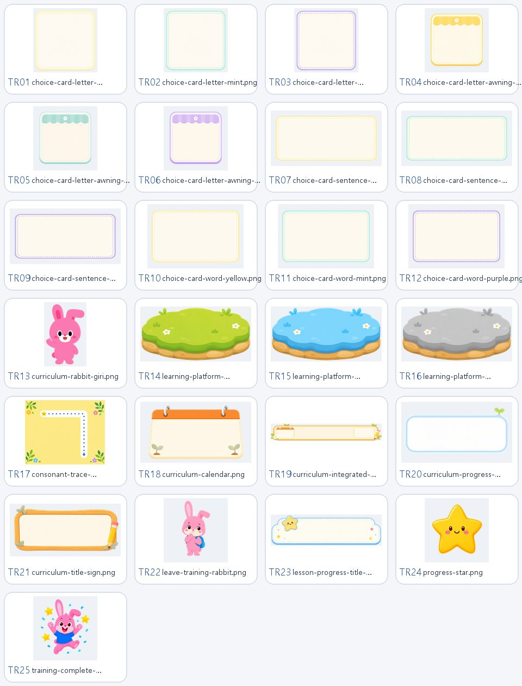

| 미리보기 | 리소스 | 크기·픽셀 | 연결 상태 | 화면·위치 | 직접 참조 | 분류·다음 검토 |
| --- | --- | ---: | --- | --- | --- | --- |
| TR01 | `training/choice-cards/choice-card-letter-yellow.png` | 264.6 KiB 640×640 | [TBD] 현재 src 코드 참조 없음 | [TBD] 현재 노출 화면 확인 안 됨 예상 용도: 글자 학습 · 모든 3지선다 선택 카드 | — | 색 변경 완료 공통 카드 variant |
| TR02 | `training/choice-cards/choice-card-letter-mint.png` | 250.7 KiB 640×640 | [TBD] 현재 src 코드 참조 없음 | [TBD] 현재 노출 화면 확인 안 됨 예상 용도: 글자 학습 · 모든 3지선다 선택 카드 | — | 색 변경 완료 공통 카드 variant |
| TR03 | `training/choice-cards/choice-card-letter-purple.png` | 251.1 KiB 640×640 | [TBD] 현재 src 코드 참조 없음 | [TBD] 현재 노출 화면 확인 안 됨 예상 용도: 글자 학습 · 모든 3지선다 선택 카드 | — | 색 변경 완료 공통 카드 variant |
| TR04 | `training/choice-cards/choice-card-letter-awning-yellow.webp` | 24.6 KiB 1254×1254 | Vue 연결 확인 | 글자 학습 · 문제 풀이 공통 화면 글자 학습 · 참조 스타일이 적용되는 화면 앱 전체 · 전역 오버레이 | `src/styles/training/TrainingLessonView.css` | 색 변경 완료 공통 카드 variant |
| TR05 | `training/choice-cards/choice-card-letter-awning-mint.webp` | 15.7 KiB 1254×1254 | Vue 연결 확인 | 글자 학습 · 문제 풀이 공통 화면 글자 학습 · 참조 스타일이 적용되는 화면 앱 전체 · 전역 오버레이 | `src/styles/training/TrainingLessonView.css` | 색 변경 완료 공통 카드 variant |
| TR06 | `training/choice-cards/choice-card-letter-awning-purple.webp` | 24.5 KiB 1254×1254 | Vue 연결 확인 | 글자 학습 · 문제 풀이 공통 화면 글자 학습 · 참조 스타일이 적용되는 화면 앱 전체 · 전역 오버레이 | `src/styles/training/TrainingLessonView.css` | 색 변경 완료 공통 카드 variant |
| TR07 | `training/choice-cards/choice-card-sentence-yellow.png` | 256.7 KiB 1024×512 | Vue 연결 확인 | 글자 학습 · 문제 풀이 공통 화면 글자 학습 · 참조 스타일이 적용되는 화면 앱 전체 · 전역 오버레이 | `src/styles/training/TrainingLessonView.css` | 색 변경 완료 공통 카드 variant |
| TR08 | `training/choice-cards/choice-card-sentence-mint.png` | 255.0 KiB 1024×512 | Vue 연결 확인 | 글자 학습 · 문제 풀이 공통 화면 글자 학습 · 참조 스타일이 적용되는 화면 앱 전체 · 전역 오버레이 | `src/styles/training/TrainingLessonView.css` | 색 변경 완료 공통 카드 variant |
| TR09 | `training/choice-cards/choice-card-sentence-purple.png` | 257.0 KiB 1024×512 | Vue 연결 확인 | 글자 학습 · 문제 풀이 공통 화면 글자 학습 · 참조 스타일이 적용되는 화면 앱 전체 · 전역 오버레이 | `src/styles/training/TrainingLessonView.css` | 색 변경 완료 공통 카드 variant |
| TR10 | `training/choice-cards/choice-card-word-yellow.png` | 221.8 KiB 768×512 | Vue 연결 확인 | 글자 학습 · 문제 풀이 공통 화면 글자 학습 · 참조 스타일이 적용되는 화면 앱 전체 · 전역 오버레이 | `src/styles/training/TrainingLessonView.css` | 색 변경 완료 공통 카드 variant |
| TR11 | `training/choice-cards/choice-card-word-mint.png` | 217.3 KiB 768×512 | Vue 연결 확인 | 글자 학습 · 문제 풀이 공통 화면 글자 학습 · 참조 스타일이 적용되는 화면 앱 전체 · 전역 오버레이 | `src/styles/training/TrainingLessonView.css` | 색 변경 완료 공통 카드 variant |
| TR12 | `training/choice-cards/choice-card-word-purple.png` | 218.6 KiB 768×512 | Vue 연결 확인 | 글자 학습 · 문제 풀이 공통 화면 글자 학습 · 참조 스타일이 적용되는 화면 앱 전체 · 전역 오버레이 | `src/styles/training/TrainingLessonView.css` | 색 변경 완료 공통 카드 variant |
| TR13 | `training/curriculum-rabbit-giri.png` | 422.3 KiB 774×1175 | Vue 연결 확인 | 글자 학습 · 커리큘럼 경로 글자 학습 · 커리큘럼/훈련 선택 앱 전체 · 전역 오버레이 | `src/components/training/TrainingCurriculumPath.vue` | 유지+검수 학습 상태 보드에서 검수 |
| TR14 | `training/learning-platform-complete.png` | 497.7 KiB 1078×534 | Vue 연결 확인 | 글자 학습 · 커리큘럼 경로 글자 학습 · 커리큘럼/훈련 선택 앱 전체 · 전역 오버레이 | `src/components/training/TrainingCurriculumPath.vue` | 유지+검수 학습 상태 보드에서 검수 |
| TR15 | `training/learning-platform-current.png` | 451.8 KiB 1078×534 | Vue 연결 확인 | 글자 학습 · 커리큘럼 경로 글자 학습 · 커리큘럼/훈련 선택 앱 전체 · 전역 오버레이 | `src/components/training/TrainingCurriculumPath.vue` | 유지+검수 학습 상태 보드에서 검수 |
| TR16 | `training/learning-platform-locked.png` | 489.6 KiB 1079×534 | Vue 연결 확인 | 글자 학습 · 커리큘럼 경로 글자 학습 · 커리큘럼/훈련 선택 앱 전체 · 전역 오버레이 | `src/components/training/TrainingCurriculumPath.vue` | 유지+검수 학습 상태 보드에서 검수 |
| TR17 | `training/ui/consonant-trace-background.png` | 969.2 KiB 1402×1122 | Vue 연결 확인 | 글자 학습 · GazeTrace 활동 글자 학습 · 문제 풀이 공통 화면 글자 학습 · 참조 스타일이 적용되는 화면 앱 전체 · 전역 오버레이 | `src/styles/training/activities/GazeTraceActivity.css` | 유지+검수 학습 상태 보드에서 검수 |
| TR18 | `training/ui/curriculum-calendar.png` | 700.9 KiB 1690×931 | [TBD] 현재 src 코드 참조 없음 | [TBD] 현재 노출 화면 확인 안 됨 예상 용도: 글자 학습 · 진행도/커리큘럼/완료 UI | — | 유지+검수 학습 상태 보드에서 검수 |
| TR19 | `training/ui/curriculum-integrated-header.webp` | 263.2 KiB 2048×314 | Vue 연결 확인 | 글자 학습 · 커리큘럼 경로 글자 학습 · 커리큘럼/훈련 선택 앱 전체 · 전역 오버레이 | `src/components/training/TrainingCurriculumPath.vue` | 유지+검수 학습 상태 보드에서 검수 |
| TR20 | `training/ui/curriculum-progress-card.png` | 522.9 KiB 1693×929 | [TBD] 현재 src 코드 참조 없음 | [TBD] 현재 노출 화면 확인 안 됨 예상 용도: 글자 학습 · 진행도/커리큘럼/완료 UI | — | 유지+검수 학습 상태 보드에서 검수 |
| TR21 | `training/ui/curriculum-title-sign.png` | 791.3 KiB 1823×863 | [TBD] 현재 src 코드 참조 없음 | [TBD] 현재 노출 화면 확인 안 됨 예상 용도: 글자 학습 · 진행도/커리큘럼/완료 UI | — | 유지+검수 학습 상태 보드에서 검수 |
| TR22 | `training/ui/leave-training-rabbit.png` | 391.1 KiB 1254×1254 | Vue 연결 확인 | 글자 학습 · 문제 풀이 공통 화면 앱 전체 · 전역 오버레이 | `src/views/learner/TrainingLessonView.vue` | 유지+검수 학습 상태 보드에서 검수 |
| TR23 | `training/ui/lesson-progress-title-board.webp` | 34.7 KiB 1889×528 | Vue 연결 확인 | 글자 학습 · 문제 풀이 공통 화면 앱 전체 · 전역 오버레이 | `src/views/learner/TrainingLessonView.vue` | 유지+검수 학습 상태 보드에서 검수 |
| TR24 | `training/ui/progress-star.png` | 60.6 KiB 320×320 | Vue 연결 확인 | 글자 학습 · HangulBattle 활동 글자 학습 · SentenceReading 활동 글자 학습 · WordReadingGrid 활동 글자 학습 · 문제 세트 완료 글자 학습 · 문제 풀이 공통 화면 글자 학습 · 일반/올정답 완료 앱 전체 · 전역 오버레이 이야기 나라 · 책 선택/이어 읽기 | `src/components/training/activities/HangulBattleActivity.vue` `src/components/training/activities/SentenceReadingActivity.vue` `src/components/training/activities/WordReadingGridActivity.vue` `src/components/training/TrainingComplete.vue` `외 1개` | 유지+검수 학습 상태 보드에서 검수 |
| TR25 | `training/ui/training-complete-rabbit.png` | 537.7 KiB 1254×1254 | Vue 연결 확인 | 글자 학습 · 문제 세트 완료 글자 학습 · 일반/올정답 완료 실력 도전 · 완료 앱 전체 · 전역 오버레이 오늘의 학습 · 전체 완료 | `src/components/training/TrainingComplete.vue` `src/views/learner/SkillChallengeCompleteView.vue` `src/views/learner/TodayTrainingCompleteView.vue` | 유지+검수 학습 상태 보드에서 검수 |

## 누락 리소스

| 리소스 | 표시 예정 화면·위치 | 상태 |
| --- | --- | --- |
| 쌍자음 카드 | 글자 학습 · 자모 선택 카드 | 신규 필요 |
| 가방, 나비, 모자, 다리, 사과 그림 | 글자 학습 · 그림-문장/낱말 연결 카드 | 신규 필요 |
| 기리 토끼 도움·일반 정답·올정답 완료 상태 | 글자 학습 · 화면 우측 안내/완료 | 신규 필요 |
| 이야기 친구 정원 공통 캔버스 | 성장 정원 · 고정 4슬롯 | template 필요 |
| 기리 토끼와 이야기 친구 음성 | 글자 학습 안내/성장 정원 감사 인사 | 녹음 필요 |

신규·삭제·경로 변경 후에는 생성 스크립트를 다시 실행하고 문서 검증을 수행한다.
